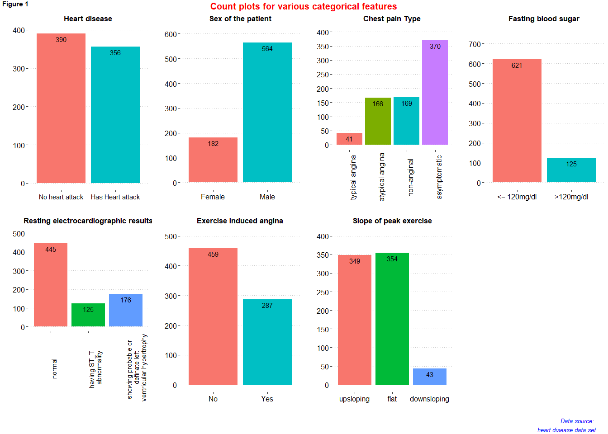
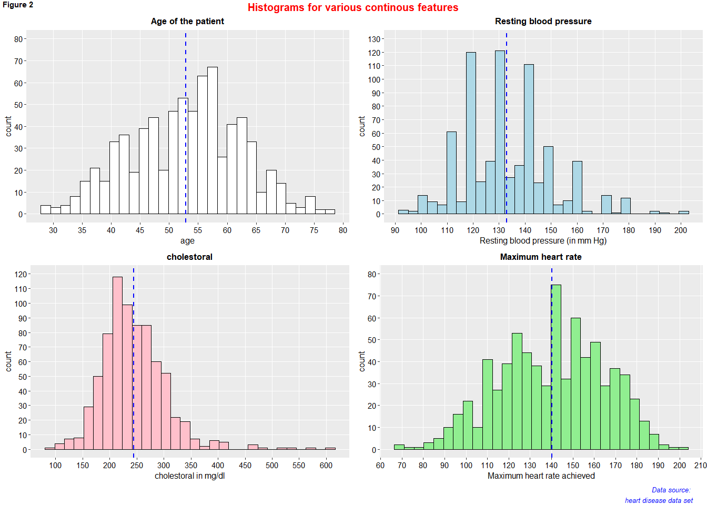
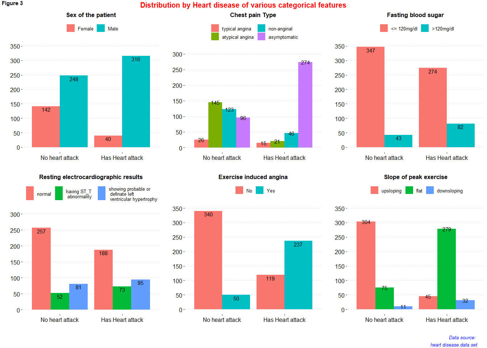
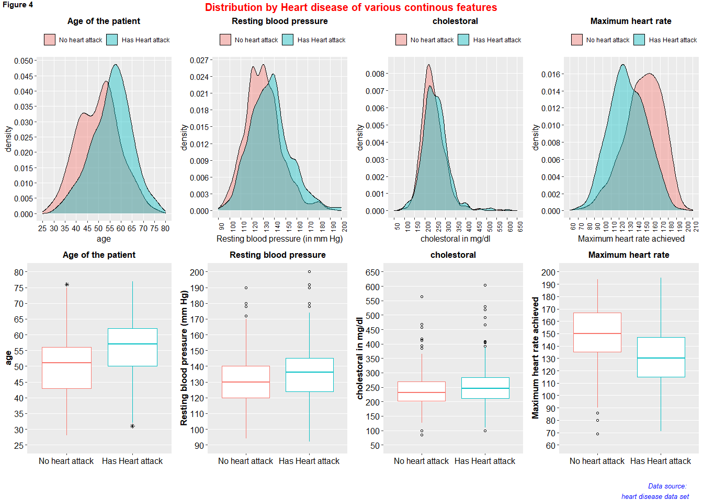
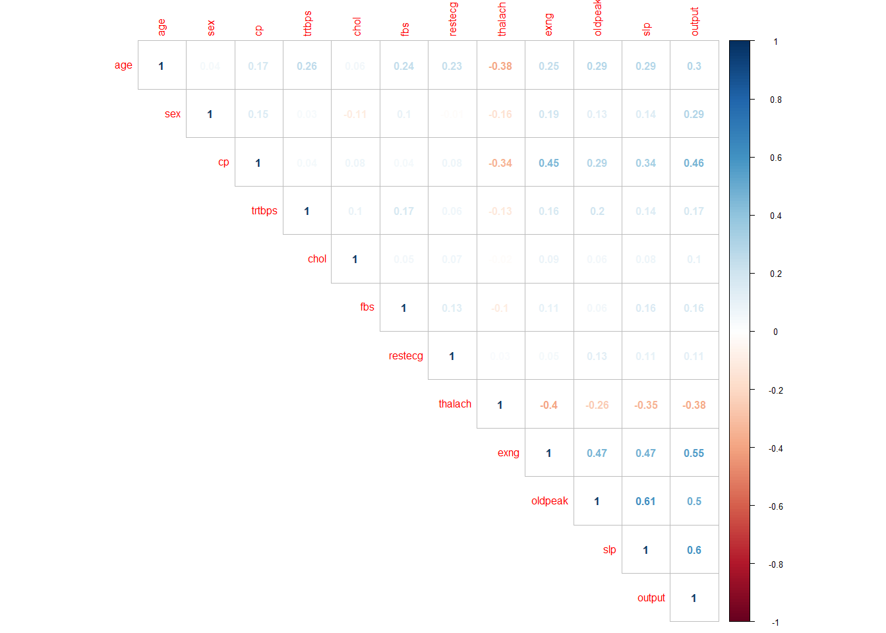
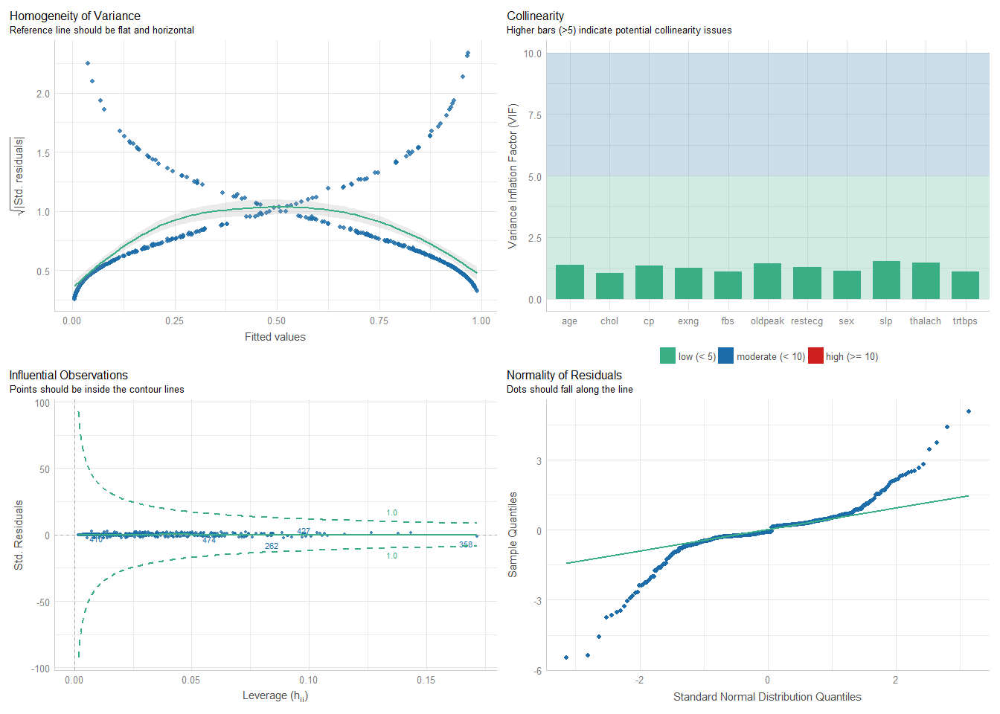

# Introduction

## Overview

Cardiovascular diseases (CVDs) are the number 1 cause of death globally, taking an estimated 17.9 million lives each year, which accounts for 31% of all deaths worldwide. Four out of 5CVD deaths are due to heart attacks and strokes, and one-third of these deaths occur prematurely in people under 70 years of age. This makes it important for health facilities to be able to predict occurrences of heart diseases in order to make plans for early treatment (Assmann et al. 2005). Heart failure is a common event caused by CVDs and this dataset contains 11 features that can be used to predict a possible heart disease.

People with cardiovascular disease or who are at high cardiovascular risk (due to the presence of one or more risk factors such as hypertension, diabetes, hyperlipidaemia or already established disease) need early detection and management wherein a machine learning model can be of great help.


## About the Data

This dataset contains 918 observations with 12 features. The data dictionary is as follows:

- output: target variable (1=has heart attack, 0= has no heart attack)
- age: Age of the patient
- sex: Sex of the patient  (1= male, 0= female).
- cp: chest pain type (0=typical angina, 1=atypical angina, 2=non-anginal and 3=asymptomatic)
- trtbps: resting blood pressure (in mm Hg) 
- chol: cholestoral in mg/dl fetched via BMI sensor 
- fbs: fasting blood sugar (>120mg/dl=1, <= 120mg/dl=0).
- restecg: resting electrocardiographic results( 0=normal, 1=having ST-T wave abnormality,
2=showing probable or definate left ventricular hypertrophy by Este’s criteria.) 
- thalach: Maximum heart rate achieved.
- exng: exercise induced angina; 1=yes, 0=no. 
- oldpeak: ST depression. 
- slp = slope of peak exercise; 0=upsloping, 1=flat, 2=downsloping.

# Data Exploration


## loading Relevant packages


```r
#Import relevant packages

library(tidyverse)
library(janitor)
library(readr)
library(plotly)
library(knitr)
```


## loading Data Set


```r
heart_disease <- read_csv('F:/Documents/Reinp/GitHub Respositories/Predicting-heart-disease/data/heart.csv')%>%
  clean_names()


#View(heart_disease)
head(heart_disease)
```

```
## # A tibble: 6 x 12
##     age   sex    cp trtbps  chol   fbs restecg thalach  exng oldpeak   slp
##   <dbl> <dbl> <dbl>  <dbl> <dbl> <dbl>   <dbl>   <dbl> <dbl>   <dbl> <dbl>
## 1    40     1     1    140   289     0       0     172     0     0       0
## 2    49     0     2    160   180     0       0     156     0     1       1
## 3    37     1     1    130   283     0       1      98     0     0       0
## 4    48     0     3    138   214     0       0     108     1     1.5     1
## 5    54     1     2    150   195     0       0     122     0     0       0
## 6    39     1     2    120   339     0       0     170     0     0       0
## # ... with 1 more variable: output <dbl>
```


```r
##checking the data structure

str(heart_disease)
```

```
## spec_tbl_df [918 x 12] (S3: spec_tbl_df/tbl_df/tbl/data.frame)
##  $ age    : num [1:918] 40 49 37 48 54 39 45 54 37 48 ...
##  $ sex    : num [1:918] 1 0 1 0 1 1 0 1 1 0 ...
##  $ cp     : num [1:918] 1 2 1 3 2 2 1 1 3 1 ...
##  $ trtbps : num [1:918] 140 160 130 138 150 120 130 110 140 120 ...
##  $ chol   : num [1:918] 289 180 283 214 195 339 237 208 207 284 ...
##  $ fbs    : num [1:918] 0 0 0 0 0 0 0 0 0 0 ...
##  $ restecg: num [1:918] 0 0 1 0 0 0 0 0 0 0 ...
##  $ thalach: num [1:918] 172 156 98 108 122 170 170 142 130 120 ...
##  $ exng   : num [1:918] 0 0 0 1 0 0 0 0 1 0 ...
##  $ oldpeak: num [1:918] 0 1 0 1.5 0 0 0 0 1.5 0 ...
##  $ slp    : num [1:918] 0 1 0 1 0 0 0 0 1 0 ...
##  $ output : num [1:918] 0 1 0 1 0 0 0 0 1 0 ...
##  - attr(*, "spec")=
##   .. cols(
##   ..   age = col_double(),
##   ..   sex = col_double(),
##   ..   cp = col_double(),
##   ..   trtbps = col_double(),
##   ..   chol = col_double(),
##   ..   fbs = col_double(),
##   ..   restecg = col_double(),
##   ..   thalach = col_double(),
##   ..   exng = col_double(),
##   ..   oldpeak = col_double(),
##   ..   slp = col_double(),
##   ..   output = col_double()
##   .. )
##  - attr(*, "problems")=<externalptr>
```

From the output on the data structure, all of the data has been read as numeric values('double' value or a decimal type with at least two decimal places) but some should be converted to factors since they are categorical.

## Converting into factors


```r
heart_disease_final <- heart_disease%>%
  mutate(output= factor(output, levels = c(0,1), 
                                      labels = c("No heart attack", "Has Heart attack")))%>%
  mutate(sex= factor(sex, levels = c(0,1), 
                                      labels = c("Female", "Male")))%>%
  mutate(cp= factor(cp, levels = c(0,1,2,3), 
          labels = c("typical angina", "atypical angina", "non-anginal", "asymptomatic")))%>%
  mutate(fbs= factor(fbs, levels = c(0,1), 
                                      labels = c("<= 120mg/dl", ">120mg/dl")))%>%
  mutate(restecg= factor(restecg, levels = c(0,1,2), 
          labels = c("normal", "having ST_T \n abnormality", "showing probable or \n definate left\n ventricular hypertrophy")))%>%
  mutate(exng= factor(exng, levels = c(0,1), 
                                      labels = c("No", "Yes")))%>%
  mutate(slp= factor(slp, levels = c(0,1,2), 
          labels = c("upsloping", "flat", "downsloping")))%>%
  filter(trtbps>0)%>%
  filter(chol>0)
```


```r
var.labels = c(
  age = "Age of the patient",
  sex = "Sex of the patient",
  cp = "Chest pain type",
  trtbps = "Resting blood pressure (in mm Hg)",
  chol = "Cholestoral in mg/dl",
  fbs = "Fasting blood sugar",
  restecg = "Resting electrocardiographic results",
  thalach = "Maximum heart rate achieved",
  exng = "Exercise induced angina",
  oldpeak = "ST depression",
  slp = "Slope of peak exercise",
  output = "Heart disease")

heart_disease_final <- labelled::set_variable_labels(heart_disease_final, .labels = var.labels)

str(heart_disease_final)
```

```
## tibble [746 x 12] (S3: tbl_df/tbl/data.frame)
##  $ age    : num [1:746] 40 49 37 48 54 39 45 54 37 48 ...
##   ..- attr(*, "label")= chr "Age of the patient"
##  $ sex    : Factor w/ 2 levels "Female","Male": 2 1 2 1 2 2 1 2 2 1 ...
##   ..- attr(*, "label")= chr "Sex of the patient"
##  $ cp     : Factor w/ 4 levels "typical angina",..: 2 3 2 4 3 3 2 2 4 2 ...
##   ..- attr(*, "label")= chr "Chest pain type"
##  $ trtbps : num [1:746] 140 160 130 138 150 120 130 110 140 120 ...
##   ..- attr(*, "label")= chr "Resting blood pressure (in mm Hg)"
##  $ chol   : num [1:746] 289 180 283 214 195 339 237 208 207 284 ...
##   ..- attr(*, "label")= chr "Cholestoral in mg/dl"
##  $ fbs    : Factor w/ 2 levels "<= 120mg/dl",..: 1 1 1 1 1 1 1 1 1 1 ...
##   ..- attr(*, "label")= chr "Fasting blood sugar"
##  $ restecg: Factor w/ 3 levels "normal","having ST_T \n abnormality",..: 1 1 2 1 1 1 1 1 1 1 ...
##   ..- attr(*, "label")= chr "Resting electrocardiographic results"
##  $ thalach: num [1:746] 172 156 98 108 122 170 170 142 130 120 ...
##   ..- attr(*, "label")= chr "Maximum heart rate achieved"
##  $ exng   : Factor w/ 2 levels "No","Yes": 1 1 1 2 1 1 1 1 2 1 ...
##   ..- attr(*, "label")= chr "Exercise induced angina"
##  $ oldpeak: num [1:746] 0 1 0 1.5 0 0 0 0 1.5 0 ...
##   ..- attr(*, "label")= chr "ST depression"
##  $ slp    : Factor w/ 3 levels "upsloping","flat",..: 1 2 1 2 1 1 1 1 2 1 ...
##   ..- attr(*, "label")= chr "Slope of peak exercise"
##  $ output : Factor w/ 2 levels "No heart attack",..: 1 2 1 2 1 1 1 1 2 1 ...
##   ..- attr(*, "label")= chr "Heart disease"
```


The categorial columns are sex, cp, fbs, restecg, exng, slp while continuous columns are age, trtbps, chol, thalach, oldpeak and target variable is output

## checking missing values


```r
mean(is.na(heart_disease_final))
```

```
## [1] 0
```

```r
#which(is.na(heart_disease_final))

#which(!complete.cases(heart_disease_final))
```
There were no missing values in our data set.

# Exploratory data analysis

Exploring data is vital in giving a clue of the expected relationship between the dependent variable and the exploratory variables (Zuur et al. 2010).

## Univariate analysis

This is analysis of one variable to enable us understand the distribution of values for a single variable.

### Descriptives Frequency table


```r
library(gtsummary)
library(flextable)

set_gtsummary_theme(list(
  "tbl_summary-fn:percent_fun" = function(x) style_percent(x, digits = 1),
  "tbl_summary-str:categorical_stat" = "{n} ({p}%)"
))
# Setting `Compact` theme
theme_gtsummary_compact()
```


```r
# make dataset with variables to summarize

      
tbl_summary(heart_disease_final,
                      type = list(
                        all_dichotomous() ~ "categorical",
                         all_continuous() ~ "continuous2")
                      , statistic = all_continuous() ~ c(
                                     "{mean} ({sd})", 
                                     "{median} ({p25}, {p75})", 
                                     "{min}, {max}")
                      , digits = all_continuous() ~ 2
                      , missing = "always" # don't list missing data separately
                      ,missing_text = "Missing"
                      ) %>% 
  modify_header(label = "**Descriptives**") %>% # update the column header
  bold_labels() %>%
  italicize_levels()%>%
  add_n() # add column with total number of non-missing observations
```

```{=html}
<div id="mbdxfwnhhc" style="overflow-x:auto;overflow-y:auto;width:auto;height:auto;">
<style>html {
  font-family: -apple-system, BlinkMacSystemFont, 'Segoe UI', Roboto, Oxygen, Ubuntu, Cantarell, 'Helvetica Neue', 'Fira Sans', 'Droid Sans', Arial, sans-serif;
}

#mbdxfwnhhc .gt_table {
  display: table;
  border-collapse: collapse;
  margin-left: auto;
  margin-right: auto;
  color: #333333;
  font-size: 13px;
  font-weight: normal;
  font-style: normal;
  background-color: #FFFFFF;
  width: auto;
  border-top-style: solid;
  border-top-width: 2px;
  border-top-color: #A8A8A8;
  border-right-style: none;
  border-right-width: 2px;
  border-right-color: #D3D3D3;
  border-bottom-style: solid;
  border-bottom-width: 2px;
  border-bottom-color: #A8A8A8;
  border-left-style: none;
  border-left-width: 2px;
  border-left-color: #D3D3D3;
}

#mbdxfwnhhc .gt_heading {
  background-color: #FFFFFF;
  text-align: center;
  border-bottom-color: #FFFFFF;
  border-left-style: none;
  border-left-width: 1px;
  border-left-color: #D3D3D3;
  border-right-style: none;
  border-right-width: 1px;
  border-right-color: #D3D3D3;
}

#mbdxfwnhhc .gt_title {
  color: #333333;
  font-size: 125%;
  font-weight: initial;
  padding-top: 4px;
  padding-bottom: 4px;
  padding-left: 5px;
  padding-right: 5px;
  border-bottom-color: #FFFFFF;
  border-bottom-width: 0;
}

#mbdxfwnhhc .gt_subtitle {
  color: #333333;
  font-size: 85%;
  font-weight: initial;
  padding-top: 0;
  padding-bottom: 6px;
  padding-left: 5px;
  padding-right: 5px;
  border-top-color: #FFFFFF;
  border-top-width: 0;
}

#mbdxfwnhhc .gt_bottom_border {
  border-bottom-style: solid;
  border-bottom-width: 2px;
  border-bottom-color: #D3D3D3;
}

#mbdxfwnhhc .gt_col_headings {
  border-top-style: solid;
  border-top-width: 2px;
  border-top-color: #D3D3D3;
  border-bottom-style: solid;
  border-bottom-width: 2px;
  border-bottom-color: #D3D3D3;
  border-left-style: none;
  border-left-width: 1px;
  border-left-color: #D3D3D3;
  border-right-style: none;
  border-right-width: 1px;
  border-right-color: #D3D3D3;
}

#mbdxfwnhhc .gt_col_heading {
  color: #333333;
  background-color: #FFFFFF;
  font-size: 100%;
  font-weight: normal;
  text-transform: inherit;
  border-left-style: none;
  border-left-width: 1px;
  border-left-color: #D3D3D3;
  border-right-style: none;
  border-right-width: 1px;
  border-right-color: #D3D3D3;
  vertical-align: bottom;
  padding-top: 5px;
  padding-bottom: 6px;
  padding-left: 5px;
  padding-right: 5px;
  overflow-x: hidden;
}

#mbdxfwnhhc .gt_column_spanner_outer {
  color: #333333;
  background-color: #FFFFFF;
  font-size: 100%;
  font-weight: normal;
  text-transform: inherit;
  padding-top: 0;
  padding-bottom: 0;
  padding-left: 4px;
  padding-right: 4px;
}

#mbdxfwnhhc .gt_column_spanner_outer:first-child {
  padding-left: 0;
}

#mbdxfwnhhc .gt_column_spanner_outer:last-child {
  padding-right: 0;
}

#mbdxfwnhhc .gt_column_spanner {
  border-bottom-style: solid;
  border-bottom-width: 2px;
  border-bottom-color: #D3D3D3;
  vertical-align: bottom;
  padding-top: 5px;
  padding-bottom: 5px;
  overflow-x: hidden;
  display: inline-block;
  width: 100%;
}

#mbdxfwnhhc .gt_group_heading {
  padding-top: 1px;
  padding-bottom: 1px;
  padding-left: 5px;
  padding-right: 5px;
  color: #333333;
  background-color: #FFFFFF;
  font-size: 100%;
  font-weight: initial;
  text-transform: inherit;
  border-top-style: solid;
  border-top-width: 2px;
  border-top-color: #D3D3D3;
  border-bottom-style: solid;
  border-bottom-width: 2px;
  border-bottom-color: #D3D3D3;
  border-left-style: none;
  border-left-width: 1px;
  border-left-color: #D3D3D3;
  border-right-style: none;
  border-right-width: 1px;
  border-right-color: #D3D3D3;
  vertical-align: middle;
}

#mbdxfwnhhc .gt_empty_group_heading {
  padding: 0.5px;
  color: #333333;
  background-color: #FFFFFF;
  font-size: 100%;
  font-weight: initial;
  border-top-style: solid;
  border-top-width: 2px;
  border-top-color: #D3D3D3;
  border-bottom-style: solid;
  border-bottom-width: 2px;
  border-bottom-color: #D3D3D3;
  vertical-align: middle;
}

#mbdxfwnhhc .gt_from_md > :first-child {
  margin-top: 0;
}

#mbdxfwnhhc .gt_from_md > :last-child {
  margin-bottom: 0;
}

#mbdxfwnhhc .gt_row {
  padding-top: 1px;
  padding-bottom: 1px;
  padding-left: 5px;
  padding-right: 5px;
  margin: 10px;
  border-top-style: solid;
  border-top-width: 1px;
  border-top-color: #D3D3D3;
  border-left-style: none;
  border-left-width: 1px;
  border-left-color: #D3D3D3;
  border-right-style: none;
  border-right-width: 1px;
  border-right-color: #D3D3D3;
  vertical-align: middle;
  overflow-x: hidden;
}

#mbdxfwnhhc .gt_stub {
  color: #333333;
  background-color: #FFFFFF;
  font-size: 100%;
  font-weight: initial;
  text-transform: inherit;
  border-right-style: solid;
  border-right-width: 2px;
  border-right-color: #D3D3D3;
  padding-left: 5px;
  padding-right: 5px;
}

#mbdxfwnhhc .gt_stub_row_group {
  color: #333333;
  background-color: #FFFFFF;
  font-size: 100%;
  font-weight: initial;
  text-transform: inherit;
  border-right-style: solid;
  border-right-width: 2px;
  border-right-color: #D3D3D3;
  padding-left: 5px;
  padding-right: 5px;
  vertical-align: top;
}

#mbdxfwnhhc .gt_row_group_first td {
  border-top-width: 2px;
}

#mbdxfwnhhc .gt_summary_row {
  color: #333333;
  background-color: #FFFFFF;
  text-transform: inherit;
  padding-top: 1px;
  padding-bottom: 1px;
  padding-left: 5px;
  padding-right: 5px;
}

#mbdxfwnhhc .gt_first_summary_row {
  border-top-style: solid;
  border-top-color: #D3D3D3;
}

#mbdxfwnhhc .gt_first_summary_row.thick {
  border-top-width: 2px;
}

#mbdxfwnhhc .gt_last_summary_row {
  padding-top: 1px;
  padding-bottom: 1px;
  padding-left: 5px;
  padding-right: 5px;
  border-bottom-style: solid;
  border-bottom-width: 2px;
  border-bottom-color: #D3D3D3;
}

#mbdxfwnhhc .gt_grand_summary_row {
  color: #333333;
  background-color: #FFFFFF;
  text-transform: inherit;
  padding-top: 1px;
  padding-bottom: 1px;
  padding-left: 5px;
  padding-right: 5px;
}

#mbdxfwnhhc .gt_first_grand_summary_row {
  padding-top: 1px;
  padding-bottom: 1px;
  padding-left: 5px;
  padding-right: 5px;
  border-top-style: double;
  border-top-width: 6px;
  border-top-color: #D3D3D3;
}

#mbdxfwnhhc .gt_striped {
  background-color: rgba(128, 128, 128, 0.05);
}

#mbdxfwnhhc .gt_table_body {
  border-top-style: solid;
  border-top-width: 2px;
  border-top-color: #D3D3D3;
  border-bottom-style: solid;
  border-bottom-width: 2px;
  border-bottom-color: #D3D3D3;
}

#mbdxfwnhhc .gt_footnotes {
  color: #333333;
  background-color: #FFFFFF;
  border-bottom-style: none;
  border-bottom-width: 2px;
  border-bottom-color: #D3D3D3;
  border-left-style: none;
  border-left-width: 2px;
  border-left-color: #D3D3D3;
  border-right-style: none;
  border-right-width: 2px;
  border-right-color: #D3D3D3;
}

#mbdxfwnhhc .gt_footnote {
  margin: 0px;
  font-size: 90%;
  padding-left: 1px;
  padding-right: 1px;
  padding-left: 5px;
  padding-right: 5px;
}

#mbdxfwnhhc .gt_sourcenotes {
  color: #333333;
  background-color: #FFFFFF;
  border-bottom-style: none;
  border-bottom-width: 2px;
  border-bottom-color: #D3D3D3;
  border-left-style: none;
  border-left-width: 2px;
  border-left-color: #D3D3D3;
  border-right-style: none;
  border-right-width: 2px;
  border-right-color: #D3D3D3;
}

#mbdxfwnhhc .gt_sourcenote {
  font-size: 90%;
  padding-top: 1px;
  padding-bottom: 1px;
  padding-left: 5px;
  padding-right: 5px;
}

#mbdxfwnhhc .gt_left {
  text-align: left;
}

#mbdxfwnhhc .gt_center {
  text-align: center;
}

#mbdxfwnhhc .gt_right {
  text-align: right;
  font-variant-numeric: tabular-nums;
}

#mbdxfwnhhc .gt_font_normal {
  font-weight: normal;
}

#mbdxfwnhhc .gt_font_bold {
  font-weight: bold;
}

#mbdxfwnhhc .gt_font_italic {
  font-style: italic;
}

#mbdxfwnhhc .gt_super {
  font-size: 65%;
}

#mbdxfwnhhc .gt_footnote_marks {
  font-style: italic;
  font-weight: normal;
  font-size: 75%;
  vertical-align: 0.4em;
}

#mbdxfwnhhc .gt_asterisk {
  font-size: 100%;
  vertical-align: 0;
}

#mbdxfwnhhc .gt_slash_mark {
  font-size: 0.7em;
  line-height: 0.7em;
  vertical-align: 0.15em;
}

#mbdxfwnhhc .gt_fraction_numerator {
  font-size: 0.6em;
  line-height: 0.6em;
  vertical-align: 0.45em;
}

#mbdxfwnhhc .gt_fraction_denominator {
  font-size: 0.6em;
  line-height: 0.6em;
  vertical-align: -0.05em;
}
</style>
<table class="gt_table">
  
  <thead class="gt_col_headings">
    <tr>
      <th class="gt_col_heading gt_columns_bottom_border gt_left" rowspan="1" colspan="1"><strong>Descriptives</strong></th>
      <th class="gt_col_heading gt_columns_bottom_border gt_center" rowspan="1" colspan="1"><strong>N</strong></th>
      <th class="gt_col_heading gt_columns_bottom_border gt_center" rowspan="1" colspan="1"><strong>N = 746</strong><sup class="gt_footnote_marks">1</sup></th>
    </tr>
  </thead>
  <tbody class="gt_table_body">
    <tr><td class="gt_row gt_left" style="font-weight: bold;">Age of the patient</td>
<td class="gt_row gt_center">746</td>
<td class="gt_row gt_center"></td></tr>
    <tr><td class="gt_row gt_left" style="text-align: left; text-indent: 10px; font-style: italic;">Mean (SD)</td>
<td class="gt_row gt_center"></td>
<td class="gt_row gt_center">52.88 (9.51)</td></tr>
    <tr><td class="gt_row gt_left" style="text-align: left; text-indent: 10px; font-style: italic;">Median (IQR)</td>
<td class="gt_row gt_center"></td>
<td class="gt_row gt_center">54.00 (46.00, 59.00)</td></tr>
    <tr><td class="gt_row gt_left" style="text-align: left; text-indent: 10px; font-style: italic;">Range</td>
<td class="gt_row gt_center"></td>
<td class="gt_row gt_center">28.00, 77.00</td></tr>
    <tr><td class="gt_row gt_left" style="text-align: left; text-indent: 10px; font-style: italic;">Missing</td>
<td class="gt_row gt_center"></td>
<td class="gt_row gt_center">0</td></tr>
    <tr><td class="gt_row gt_left" style="font-weight: bold;">Sex of the patient</td>
<td class="gt_row gt_center">746</td>
<td class="gt_row gt_center"></td></tr>
    <tr><td class="gt_row gt_left" style="text-align: left; text-indent: 10px; font-style: italic;">Female</td>
<td class="gt_row gt_center"></td>
<td class="gt_row gt_center">182 (24.4%)</td></tr>
    <tr><td class="gt_row gt_left" style="text-align: left; text-indent: 10px; font-style: italic;">Male</td>
<td class="gt_row gt_center"></td>
<td class="gt_row gt_center">564 (75.6%)</td></tr>
    <tr><td class="gt_row gt_left" style="text-align: left; text-indent: 10px; font-style: italic;">Missing</td>
<td class="gt_row gt_center"></td>
<td class="gt_row gt_center">0</td></tr>
    <tr><td class="gt_row gt_left" style="font-weight: bold;">Chest pain type</td>
<td class="gt_row gt_center">746</td>
<td class="gt_row gt_center"></td></tr>
    <tr><td class="gt_row gt_left" style="text-align: left; text-indent: 10px; font-style: italic;">typical angina</td>
<td class="gt_row gt_center"></td>
<td class="gt_row gt_center">41 (5.50%)</td></tr>
    <tr><td class="gt_row gt_left" style="text-align: left; text-indent: 10px; font-style: italic;">atypical angina</td>
<td class="gt_row gt_center"></td>
<td class="gt_row gt_center">166 (22.3%)</td></tr>
    <tr><td class="gt_row gt_left" style="text-align: left; text-indent: 10px; font-style: italic;">non-anginal</td>
<td class="gt_row gt_center"></td>
<td class="gt_row gt_center">169 (22.7%)</td></tr>
    <tr><td class="gt_row gt_left" style="text-align: left; text-indent: 10px; font-style: italic;">asymptomatic</td>
<td class="gt_row gt_center"></td>
<td class="gt_row gt_center">370 (49.6%)</td></tr>
    <tr><td class="gt_row gt_left" style="text-align: left; text-indent: 10px; font-style: italic;">Missing</td>
<td class="gt_row gt_center"></td>
<td class="gt_row gt_center">0</td></tr>
    <tr><td class="gt_row gt_left" style="font-weight: bold;">Resting blood pressure (in mm Hg)</td>
<td class="gt_row gt_center">746</td>
<td class="gt_row gt_center"></td></tr>
    <tr><td class="gt_row gt_left" style="text-align: left; text-indent: 10px; font-style: italic;">Mean (SD)</td>
<td class="gt_row gt_center"></td>
<td class="gt_row gt_center">133.02 (17.28)</td></tr>
    <tr><td class="gt_row gt_left" style="text-align: left; text-indent: 10px; font-style: italic;">Median (IQR)</td>
<td class="gt_row gt_center"></td>
<td class="gt_row gt_center">130.00 (120.00, 140.00)</td></tr>
    <tr><td class="gt_row gt_left" style="text-align: left; text-indent: 10px; font-style: italic;">Range</td>
<td class="gt_row gt_center"></td>
<td class="gt_row gt_center">92.00, 200.00</td></tr>
    <tr><td class="gt_row gt_left" style="text-align: left; text-indent: 10px; font-style: italic;">Missing</td>
<td class="gt_row gt_center"></td>
<td class="gt_row gt_center">0</td></tr>
    <tr><td class="gt_row gt_left" style="font-weight: bold;">Cholestoral in mg/dl</td>
<td class="gt_row gt_center">746</td>
<td class="gt_row gt_center"></td></tr>
    <tr><td class="gt_row gt_left" style="text-align: left; text-indent: 10px; font-style: italic;">Mean (SD)</td>
<td class="gt_row gt_center"></td>
<td class="gt_row gt_center">244.64 (59.15)</td></tr>
    <tr><td class="gt_row gt_left" style="text-align: left; text-indent: 10px; font-style: italic;">Median (IQR)</td>
<td class="gt_row gt_center"></td>
<td class="gt_row gt_center">237.00 (207.25, 275.00)</td></tr>
    <tr><td class="gt_row gt_left" style="text-align: left; text-indent: 10px; font-style: italic;">Range</td>
<td class="gt_row gt_center"></td>
<td class="gt_row gt_center">85.00, 603.00</td></tr>
    <tr><td class="gt_row gt_left" style="text-align: left; text-indent: 10px; font-style: italic;">Missing</td>
<td class="gt_row gt_center"></td>
<td class="gt_row gt_center">0</td></tr>
    <tr><td class="gt_row gt_left" style="font-weight: bold;">Fasting blood sugar</td>
<td class="gt_row gt_center">746</td>
<td class="gt_row gt_center"></td></tr>
    <tr><td class="gt_row gt_left" style="text-align: left; text-indent: 10px; font-style: italic;">&lt;= 120mg/dl</td>
<td class="gt_row gt_center"></td>
<td class="gt_row gt_center">621 (83.2%)</td></tr>
    <tr><td class="gt_row gt_left" style="text-align: left; text-indent: 10px; font-style: italic;">&gt;120mg/dl</td>
<td class="gt_row gt_center"></td>
<td class="gt_row gt_center">125 (16.8%)</td></tr>
    <tr><td class="gt_row gt_left" style="text-align: left; text-indent: 10px; font-style: italic;">Missing</td>
<td class="gt_row gt_center"></td>
<td class="gt_row gt_center">0</td></tr>
    <tr><td class="gt_row gt_left" style="font-weight: bold;">Resting electrocardiographic results</td>
<td class="gt_row gt_center">746</td>
<td class="gt_row gt_center"></td></tr>
    <tr><td class="gt_row gt_left" style="text-align: left; text-indent: 10px; font-style: italic;">normal</td>
<td class="gt_row gt_center"></td>
<td class="gt_row gt_center">445 (59.7%)</td></tr>
    <tr><td class="gt_row gt_left" style="text-align: left; text-indent: 10px; font-style: italic;">having ST_T 
 abnormality</td>
<td class="gt_row gt_center"></td>
<td class="gt_row gt_center">125 (16.8%)</td></tr>
    <tr><td class="gt_row gt_left" style="text-align: left; text-indent: 10px; font-style: italic;">showing probable or 
 definate left
 ventricular hypertrophy</td>
<td class="gt_row gt_center"></td>
<td class="gt_row gt_center">176 (23.6%)</td></tr>
    <tr><td class="gt_row gt_left" style="text-align: left; text-indent: 10px; font-style: italic;">Missing</td>
<td class="gt_row gt_center"></td>
<td class="gt_row gt_center">0</td></tr>
    <tr><td class="gt_row gt_left" style="font-weight: bold;">Maximum heart rate achieved</td>
<td class="gt_row gt_center">746</td>
<td class="gt_row gt_center"></td></tr>
    <tr><td class="gt_row gt_left" style="text-align: left; text-indent: 10px; font-style: italic;">Mean (SD)</td>
<td class="gt_row gt_center"></td>
<td class="gt_row gt_center">140.23 (24.52)</td></tr>
    <tr><td class="gt_row gt_left" style="text-align: left; text-indent: 10px; font-style: italic;">Median (IQR)</td>
<td class="gt_row gt_center"></td>
<td class="gt_row gt_center">140.00 (122.00, 160.00)</td></tr>
    <tr><td class="gt_row gt_left" style="text-align: left; text-indent: 10px; font-style: italic;">Range</td>
<td class="gt_row gt_center"></td>
<td class="gt_row gt_center">69.00, 202.00</td></tr>
    <tr><td class="gt_row gt_left" style="text-align: left; text-indent: 10px; font-style: italic;">Missing</td>
<td class="gt_row gt_center"></td>
<td class="gt_row gt_center">0</td></tr>
    <tr><td class="gt_row gt_left" style="font-weight: bold;">Exercise induced angina</td>
<td class="gt_row gt_center">746</td>
<td class="gt_row gt_center"></td></tr>
    <tr><td class="gt_row gt_left" style="text-align: left; text-indent: 10px; font-style: italic;">No</td>
<td class="gt_row gt_center"></td>
<td class="gt_row gt_center">459 (61.5%)</td></tr>
    <tr><td class="gt_row gt_left" style="text-align: left; text-indent: 10px; font-style: italic;">Yes</td>
<td class="gt_row gt_center"></td>
<td class="gt_row gt_center">287 (38.5%)</td></tr>
    <tr><td class="gt_row gt_left" style="text-align: left; text-indent: 10px; font-style: italic;">Missing</td>
<td class="gt_row gt_center"></td>
<td class="gt_row gt_center">0</td></tr>
    <tr><td class="gt_row gt_left" style="font-weight: bold;">ST depression</td>
<td class="gt_row gt_center">746</td>
<td class="gt_row gt_center"></td></tr>
    <tr><td class="gt_row gt_left" style="text-align: left; text-indent: 10px; font-style: italic;">Mean (SD)</td>
<td class="gt_row gt_center"></td>
<td class="gt_row gt_center">0.90 (1.07)</td></tr>
    <tr><td class="gt_row gt_left" style="text-align: left; text-indent: 10px; font-style: italic;">Median (IQR)</td>
<td class="gt_row gt_center"></td>
<td class="gt_row gt_center">0.50 (0.00, 1.50)</td></tr>
    <tr><td class="gt_row gt_left" style="text-align: left; text-indent: 10px; font-style: italic;">Range</td>
<td class="gt_row gt_center"></td>
<td class="gt_row gt_center">-0.10, 6.20</td></tr>
    <tr><td class="gt_row gt_left" style="text-align: left; text-indent: 10px; font-style: italic;">Missing</td>
<td class="gt_row gt_center"></td>
<td class="gt_row gt_center">0</td></tr>
    <tr><td class="gt_row gt_left" style="font-weight: bold;">Slope of peak exercise</td>
<td class="gt_row gt_center">746</td>
<td class="gt_row gt_center"></td></tr>
    <tr><td class="gt_row gt_left" style="text-align: left; text-indent: 10px; font-style: italic;">upsloping</td>
<td class="gt_row gt_center"></td>
<td class="gt_row gt_center">349 (46.8%)</td></tr>
    <tr><td class="gt_row gt_left" style="text-align: left; text-indent: 10px; font-style: italic;">flat</td>
<td class="gt_row gt_center"></td>
<td class="gt_row gt_center">354 (47.5%)</td></tr>
    <tr><td class="gt_row gt_left" style="text-align: left; text-indent: 10px; font-style: italic;">downsloping</td>
<td class="gt_row gt_center"></td>
<td class="gt_row gt_center">43 (5.76%)</td></tr>
    <tr><td class="gt_row gt_left" style="text-align: left; text-indent: 10px; font-style: italic;">Missing</td>
<td class="gt_row gt_center"></td>
<td class="gt_row gt_center">0</td></tr>
    <tr><td class="gt_row gt_left" style="font-weight: bold;">Heart disease</td>
<td class="gt_row gt_center">746</td>
<td class="gt_row gt_center"></td></tr>
    <tr><td class="gt_row gt_left" style="text-align: left; text-indent: 10px; font-style: italic;">No heart attack</td>
<td class="gt_row gt_center"></td>
<td class="gt_row gt_center">390 (52.3%)</td></tr>
    <tr><td class="gt_row gt_left" style="text-align: left; text-indent: 10px; font-style: italic;">Has Heart attack</td>
<td class="gt_row gt_center"></td>
<td class="gt_row gt_center">356 (47.7%)</td></tr>
    <tr><td class="gt_row gt_left" style="text-align: left; text-indent: 10px; font-style: italic;">Missing</td>
<td class="gt_row gt_center"></td>
<td class="gt_row gt_center">0</td></tr>
  </tbody>
  
  <tfoot class="gt_footnotes">
    <tr>
      <td class="gt_footnote" colspan="3"><sup class="gt_footnote_marks">1</sup> n (%)</td>
    </tr>
  </tfoot>
</table>
</div>
```

### Visualization


```r
library(ggpubr)

p1 <- ggplot(heart_disease_final, aes(x=output))+
  geom_bar(aes(fill = output), show.legend = FALSE)+
  labs(x="",y="", title = "Heart disease")+
  geom_text(aes(label = ..count..), stat = "count", vjust = 1.5, colour = "black")+
  #guides(fill = FALSE)+
  theme_pubclean()+
  theme(axis.title = element_text(face="bold",color="black",size=13),
        #legend.position = "none",
        axis.text.y = element_text(color="black",size=12),
        axis.text.x = element_text(color="black",size=11),
        plot.title = element_text(hjust = 0.5, face="bold",color="black",size=13),
        panel.grid.major.x = element_blank())

p2 <- ggplot(heart_disease_final, aes(x=sex))+
  geom_bar(aes(fill = sex), show.legend = FALSE)+
  labs(x="",y="", title = "Sex of the patient")+
  scale_y_continuous(breaks = seq(0, 600, by = 100), limits = c(0, 600))+
  theme_pubclean()+
  geom_text(aes(label = ..count..), stat = "count", vjust = 1.5, colour = "black")+
  theme(axis.title = element_text(face="bold",color="black",size=13),
        axis.text = element_text(color="black",size=12),
        plot.title = element_text(hjust = 0.5, face="bold",color="black",size=13),
        panel.grid.major.x = element_blank())

p3 <- ggplot(heart_disease_final, aes(x=cp))+
  geom_bar(aes(fill = cp), show.legend = FALSE)+
  labs(x="",y="", title = "Chest pain Type")+
  scale_y_continuous(breaks = seq(0, 400, by = 50), limits = c(0, 400))+
  theme_pubclean()+
  geom_text(aes(label = ..count..), stat = "count", vjust = 1.5, colour = "black")+
  theme(axis.title = element_text(face="bold",color="black",size=13),
        axis.text.y = element_text(color="black",size=12),
        axis.text.x = element_text(color="black",size=12, angle = 90),
        plot.title = element_text(hjust = 0.5, face="bold",color="black",size=13),
        panel.grid.major.x = element_blank())


p4 <- ggplot(heart_disease_final, aes(x=fbs))+
  geom_bar(aes(fill = fbs), show.legend = FALSE)+
  labs(x="",y="", title = "Fasting blood sugar")+
  scale_y_continuous(breaks = seq(0, 750, by = 100), limits = c(0, 750))+
 theme_pubclean()+
  geom_text(aes(label = ..count..), stat = "count", vjust = 1.5, colour = "black")+
  theme(axis.title= element_text(face="bold",color="black",size=13),
        axis.text = element_text(color="black",size=12),
        plot.title = element_text(hjust = 0.5, face="bold",color="black",size=13),
        panel.grid.major.x = element_blank())

p5 <- ggplot(heart_disease_final, aes(x=restecg))+
  geom_bar(aes(fill = restecg), show.legend = FALSE)+
  labs(x="",y="", title = "Resting electrocardiographic results")+
  scale_y_continuous(breaks = seq(0, 500, by = 100), limits = c(0, 500))+
  theme_pubclean()+
  geom_text(aes(label = ..count..), stat = "count", vjust = 1.5, colour = "black")+
  theme(axis.title = element_text(face="bold",color="black",size=13),
        axis.text.y = element_text(color="black",size=12),
        axis.text.x = element_text(color="black",size=11, angle = 90),
        plot.title = element_text(hjust = 0.5, face="bold",color="black",size=13),
        panel.grid.major.x = element_blank())

p6 <- ggplot(heart_disease_final, aes(x=exng))+
  geom_bar(aes(fill = exng), show.legend = FALSE)+
  labs(x="",y="", title = "Exercise induced angina")+
  scale_y_continuous(breaks = seq(0, 500, by = 100), limits = c(0, 500))+
  theme_pubclean()+
  geom_text(aes(label = ..count..), stat = "count", vjust = 1.5, colour = "black")+
  theme(axis.title = element_text(face="bold",color="black",size=13),
        axis.text = element_text(color="black",size=12),
        plot.title = element_text(hjust = 0.5, face="bold",color="black",size=13),
        panel.grid.major.x = element_blank())


p7 <- ggplot(heart_disease_final, aes(x=slp))+
  geom_bar(aes(fill = slp), show.legend = FALSE)+
  labs(x="",y="", title = "Slope of peak exercise")+
  scale_y_continuous(breaks = seq(0, 400, by = 50), limits = c(0, 400))+
  theme_pubclean()+
  geom_text(aes(label = ..count..), stat = "count", vjust = 1.5, colour = "black")+
  theme(axis.title = element_text(face="bold",color="black",size=13),
        axis.text = element_text(color="black",size=12),
        plot.title = element_text(hjust = 0.5, face="bold",color="black",size=13),
        panel.grid.major.x = element_blank())


figure1 <- ggarrange(p1, p2, p3, p4, p5, p6, p7, 
          #labels = c("A", "B", "C","D", "E", "F", "G"),
          ncol = 4, nrow = 2)

annotate_figure(figure1,
                top = text_grob("Count plots for various categorical features",
                                color = "red", face = "bold", size = 15),
                bottom = text_grob("Data source: \n heart disease data set", color = "blue",
                                   hjust = 1, x = 0.98, face = "italic", size = 10),
                #left = text_grob("Figure arranged using ggpubr", color = "green", rot = 90),
                #right = "",
                fig.lab = "Figure 1", fig.lab.face = "bold"
                )
```

<!-- -->


```r
p8 <- ggplot(heart_disease_final, aes(x=age)) + 
  geom_histogram(color="black", fill="white")+
  geom_vline(aes(xintercept=mean(age)),
            color="blue", linetype="dashed", size=1)+
  scale_y_continuous(breaks = seq(0, 85, by = 10), limits = c(0, 80))+
  scale_x_continuous(n.breaks = 10)+
  labs(x="age",y="count", title = "Age of the patient")+
  theme(axis.title = element_text(color="black",size=12),
        axis.text = element_text(color="black",size=11),
        plot.title = element_text(hjust = 0.5, face="bold",color="black",size=13),
        panel.grid.minor.y = element_blank(),
        panel.grid.minor.x = element_blank())

p9 <-ggplot(heart_disease_final, aes(x=trtbps)) + 
  geom_histogram(color="black", fill="lightblue")+
  geom_vline(aes(xintercept=mean(trtbps)),
            color="blue", linetype="dashed", size=1)+
   scale_y_continuous(breaks = seq(0, 130, by = 10), limits = c(0, 130))+
  scale_x_continuous(n.breaks = 10)+
  labs(x="Resting blood pressure (in mm Hg)",y="count", title = "Resting blood pressure")+
  theme(axis.title = element_text(color="black",size=12),
        axis.text = element_text(color="black",size=11),
        plot.title = element_text(hjust = 0.5, face="bold",color="black",size=13),
        panel.grid.minor.y = element_blank(),
        panel.grid.minor.x = element_blank())

p10 <-ggplot(heart_disease_final, aes(x=chol)) + 
  geom_histogram(color="black", fill="pink")+
  geom_vline(aes(xintercept=mean(chol)),
            color="blue", linetype="dashed", size=1)+
  scale_y_continuous(breaks = seq(0, 120, by = 10), limits = c(0, 120))+
  scale_x_continuous(n.breaks = 12)+
  labs(x="cholestoral in mg/dl",y="count", title = "cholestoral")+
  theme(axis.title = element_text(color="black",size=12),
        axis.text = element_text(color="black",size=11),
        plot.title = element_text(hjust = 0.5, face="bold",color="black",size=13),
        panel.grid.minor.y = element_blank(),
        panel.grid.minor.x = element_blank())

p11 <-ggplot(heart_disease_final, aes(x=thalach)) + 
  geom_histogram(color="black", fill="lightgreen")+
  geom_vline(aes(xintercept=mean(thalach)),
            color="blue", linetype="dashed", size=1)+
  scale_y_continuous(breaks = seq(0, 80, by = 10), limits = c(0, 80))+
  scale_x_continuous(n.breaks = 12)+
  labs(x="Maximum heart rate achieved",y="count", title = "Maximum heart rate")+
  theme(axis.title = element_text(color="black",size=12),
        axis.text = element_text(color="black",size=11),
        plot.title = element_text(hjust = 0.5, face="bold",color="black",size=13),
        panel.grid.minor.y = element_blank(),
        panel.grid.minor.x = element_blank())


figure2 <- ggarrange(p8, p9, p10, p11,
          ncol = 2, nrow = 2)

annotate_figure(figure2,
                top = text_grob("Histograms for various continous features",
                                color = "red", face = "bold", size = 15),
                bottom = text_grob("Data source: \n heart disease data set", color = "blue",
                                   hjust = 1, x = 0.98, face = "italic", size = 10),
                #left = text_grob("Figure arranged using ggpubr", color = "green", rot = 90),
                #right = "",
                fig.lab = "Figure 2", fig.lab.face = "bold"
                )
```

<!-- -->

## Bivariate analysis


### Difference Frequency table


```r
# make dataset with variables to summarize

      
tbl_summary(heart_disease_final,
             by = output,
                      type = list(
                        all_dichotomous() ~ "categorical",
                         all_continuous() ~ "continuous2")
                      , statistic = all_continuous() ~ c(
                                     "{mean} ({sd})", 
                                     "{median} ({p25}, {p75})", 
                                     "{min}, {max}")
                      , digits = all_continuous() ~ 2
                      , missing = "always" # don't list missing data separately
                      ,missing_text = "Missing"
                      ) %>% 
  modify_header(label = "**Variables**") %>% # update the column header
  bold_labels() %>%
  italicize_levels()%>%
  add_n()%>% # add column with total number of non-missing observations
  add_p(pvalue_fun = ~style_pvalue(.x, digits = 3),
        c(age, trtbps, chol, fbs, thalach, oldpeak) ~ "t.test",
        test.args = c(age, trtbps, chol, fbs, thalach, oldpeak) ~ list(var.equal = TRUE)) %>%
  bold_p(t= 0.05) %>% # bold p-values under a given threshold (default 0.05)
  #add_overall() %>%
  #add_difference() %>% #add column for difference between two group, confidence interval, and p-value
  modify_spanning_header(c("stat_1", "stat_2") ~ "**Heart Disease**")  %>%
  #modify_caption("**Table 1. Patient Characteristics**")%>%
  modify_footnote(
    all_stat_cols() ~ "Mean (SD); Median (IQR); Range; Frequency (%)"
  )
```

```{=html}
<div id="zistbwkqsy" style="overflow-x:auto;overflow-y:auto;width:auto;height:auto;">
<style>html {
  font-family: -apple-system, BlinkMacSystemFont, 'Segoe UI', Roboto, Oxygen, Ubuntu, Cantarell, 'Helvetica Neue', 'Fira Sans', 'Droid Sans', Arial, sans-serif;
}

#zistbwkqsy .gt_table {
  display: table;
  border-collapse: collapse;
  margin-left: auto;
  margin-right: auto;
  color: #333333;
  font-size: 13px;
  font-weight: normal;
  font-style: normal;
  background-color: #FFFFFF;
  width: auto;
  border-top-style: solid;
  border-top-width: 2px;
  border-top-color: #A8A8A8;
  border-right-style: none;
  border-right-width: 2px;
  border-right-color: #D3D3D3;
  border-bottom-style: solid;
  border-bottom-width: 2px;
  border-bottom-color: #A8A8A8;
  border-left-style: none;
  border-left-width: 2px;
  border-left-color: #D3D3D3;
}

#zistbwkqsy .gt_heading {
  background-color: #FFFFFF;
  text-align: center;
  border-bottom-color: #FFFFFF;
  border-left-style: none;
  border-left-width: 1px;
  border-left-color: #D3D3D3;
  border-right-style: none;
  border-right-width: 1px;
  border-right-color: #D3D3D3;
}

#zistbwkqsy .gt_title {
  color: #333333;
  font-size: 125%;
  font-weight: initial;
  padding-top: 4px;
  padding-bottom: 4px;
  padding-left: 5px;
  padding-right: 5px;
  border-bottom-color: #FFFFFF;
  border-bottom-width: 0;
}

#zistbwkqsy .gt_subtitle {
  color: #333333;
  font-size: 85%;
  font-weight: initial;
  padding-top: 0;
  padding-bottom: 6px;
  padding-left: 5px;
  padding-right: 5px;
  border-top-color: #FFFFFF;
  border-top-width: 0;
}

#zistbwkqsy .gt_bottom_border {
  border-bottom-style: solid;
  border-bottom-width: 2px;
  border-bottom-color: #D3D3D3;
}

#zistbwkqsy .gt_col_headings {
  border-top-style: solid;
  border-top-width: 2px;
  border-top-color: #D3D3D3;
  border-bottom-style: solid;
  border-bottom-width: 2px;
  border-bottom-color: #D3D3D3;
  border-left-style: none;
  border-left-width: 1px;
  border-left-color: #D3D3D3;
  border-right-style: none;
  border-right-width: 1px;
  border-right-color: #D3D3D3;
}

#zistbwkqsy .gt_col_heading {
  color: #333333;
  background-color: #FFFFFF;
  font-size: 100%;
  font-weight: normal;
  text-transform: inherit;
  border-left-style: none;
  border-left-width: 1px;
  border-left-color: #D3D3D3;
  border-right-style: none;
  border-right-width: 1px;
  border-right-color: #D3D3D3;
  vertical-align: bottom;
  padding-top: 5px;
  padding-bottom: 6px;
  padding-left: 5px;
  padding-right: 5px;
  overflow-x: hidden;
}

#zistbwkqsy .gt_column_spanner_outer {
  color: #333333;
  background-color: #FFFFFF;
  font-size: 100%;
  font-weight: normal;
  text-transform: inherit;
  padding-top: 0;
  padding-bottom: 0;
  padding-left: 4px;
  padding-right: 4px;
}

#zistbwkqsy .gt_column_spanner_outer:first-child {
  padding-left: 0;
}

#zistbwkqsy .gt_column_spanner_outer:last-child {
  padding-right: 0;
}

#zistbwkqsy .gt_column_spanner {
  border-bottom-style: solid;
  border-bottom-width: 2px;
  border-bottom-color: #D3D3D3;
  vertical-align: bottom;
  padding-top: 5px;
  padding-bottom: 5px;
  overflow-x: hidden;
  display: inline-block;
  width: 100%;
}

#zistbwkqsy .gt_group_heading {
  padding-top: 1px;
  padding-bottom: 1px;
  padding-left: 5px;
  padding-right: 5px;
  color: #333333;
  background-color: #FFFFFF;
  font-size: 100%;
  font-weight: initial;
  text-transform: inherit;
  border-top-style: solid;
  border-top-width: 2px;
  border-top-color: #D3D3D3;
  border-bottom-style: solid;
  border-bottom-width: 2px;
  border-bottom-color: #D3D3D3;
  border-left-style: none;
  border-left-width: 1px;
  border-left-color: #D3D3D3;
  border-right-style: none;
  border-right-width: 1px;
  border-right-color: #D3D3D3;
  vertical-align: middle;
}

#zistbwkqsy .gt_empty_group_heading {
  padding: 0.5px;
  color: #333333;
  background-color: #FFFFFF;
  font-size: 100%;
  font-weight: initial;
  border-top-style: solid;
  border-top-width: 2px;
  border-top-color: #D3D3D3;
  border-bottom-style: solid;
  border-bottom-width: 2px;
  border-bottom-color: #D3D3D3;
  vertical-align: middle;
}

#zistbwkqsy .gt_from_md > :first-child {
  margin-top: 0;
}

#zistbwkqsy .gt_from_md > :last-child {
  margin-bottom: 0;
}

#zistbwkqsy .gt_row {
  padding-top: 1px;
  padding-bottom: 1px;
  padding-left: 5px;
  padding-right: 5px;
  margin: 10px;
  border-top-style: solid;
  border-top-width: 1px;
  border-top-color: #D3D3D3;
  border-left-style: none;
  border-left-width: 1px;
  border-left-color: #D3D3D3;
  border-right-style: none;
  border-right-width: 1px;
  border-right-color: #D3D3D3;
  vertical-align: middle;
  overflow-x: hidden;
}

#zistbwkqsy .gt_stub {
  color: #333333;
  background-color: #FFFFFF;
  font-size: 100%;
  font-weight: initial;
  text-transform: inherit;
  border-right-style: solid;
  border-right-width: 2px;
  border-right-color: #D3D3D3;
  padding-left: 5px;
  padding-right: 5px;
}

#zistbwkqsy .gt_stub_row_group {
  color: #333333;
  background-color: #FFFFFF;
  font-size: 100%;
  font-weight: initial;
  text-transform: inherit;
  border-right-style: solid;
  border-right-width: 2px;
  border-right-color: #D3D3D3;
  padding-left: 5px;
  padding-right: 5px;
  vertical-align: top;
}

#zistbwkqsy .gt_row_group_first td {
  border-top-width: 2px;
}

#zistbwkqsy .gt_summary_row {
  color: #333333;
  background-color: #FFFFFF;
  text-transform: inherit;
  padding-top: 1px;
  padding-bottom: 1px;
  padding-left: 5px;
  padding-right: 5px;
}

#zistbwkqsy .gt_first_summary_row {
  border-top-style: solid;
  border-top-color: #D3D3D3;
}

#zistbwkqsy .gt_first_summary_row.thick {
  border-top-width: 2px;
}

#zistbwkqsy .gt_last_summary_row {
  padding-top: 1px;
  padding-bottom: 1px;
  padding-left: 5px;
  padding-right: 5px;
  border-bottom-style: solid;
  border-bottom-width: 2px;
  border-bottom-color: #D3D3D3;
}

#zistbwkqsy .gt_grand_summary_row {
  color: #333333;
  background-color: #FFFFFF;
  text-transform: inherit;
  padding-top: 1px;
  padding-bottom: 1px;
  padding-left: 5px;
  padding-right: 5px;
}

#zistbwkqsy .gt_first_grand_summary_row {
  padding-top: 1px;
  padding-bottom: 1px;
  padding-left: 5px;
  padding-right: 5px;
  border-top-style: double;
  border-top-width: 6px;
  border-top-color: #D3D3D3;
}

#zistbwkqsy .gt_striped {
  background-color: rgba(128, 128, 128, 0.05);
}

#zistbwkqsy .gt_table_body {
  border-top-style: solid;
  border-top-width: 2px;
  border-top-color: #D3D3D3;
  border-bottom-style: solid;
  border-bottom-width: 2px;
  border-bottom-color: #D3D3D3;
}

#zistbwkqsy .gt_footnotes {
  color: #333333;
  background-color: #FFFFFF;
  border-bottom-style: none;
  border-bottom-width: 2px;
  border-bottom-color: #D3D3D3;
  border-left-style: none;
  border-left-width: 2px;
  border-left-color: #D3D3D3;
  border-right-style: none;
  border-right-width: 2px;
  border-right-color: #D3D3D3;
}

#zistbwkqsy .gt_footnote {
  margin: 0px;
  font-size: 90%;
  padding-left: 1px;
  padding-right: 1px;
  padding-left: 5px;
  padding-right: 5px;
}

#zistbwkqsy .gt_sourcenotes {
  color: #333333;
  background-color: #FFFFFF;
  border-bottom-style: none;
  border-bottom-width: 2px;
  border-bottom-color: #D3D3D3;
  border-left-style: none;
  border-left-width: 2px;
  border-left-color: #D3D3D3;
  border-right-style: none;
  border-right-width: 2px;
  border-right-color: #D3D3D3;
}

#zistbwkqsy .gt_sourcenote {
  font-size: 90%;
  padding-top: 1px;
  padding-bottom: 1px;
  padding-left: 5px;
  padding-right: 5px;
}

#zistbwkqsy .gt_left {
  text-align: left;
}

#zistbwkqsy .gt_center {
  text-align: center;
}

#zistbwkqsy .gt_right {
  text-align: right;
  font-variant-numeric: tabular-nums;
}

#zistbwkqsy .gt_font_normal {
  font-weight: normal;
}

#zistbwkqsy .gt_font_bold {
  font-weight: bold;
}

#zistbwkqsy .gt_font_italic {
  font-style: italic;
}

#zistbwkqsy .gt_super {
  font-size: 65%;
}

#zistbwkqsy .gt_footnote_marks {
  font-style: italic;
  font-weight: normal;
  font-size: 75%;
  vertical-align: 0.4em;
}

#zistbwkqsy .gt_asterisk {
  font-size: 100%;
  vertical-align: 0;
}

#zistbwkqsy .gt_slash_mark {
  font-size: 0.7em;
  line-height: 0.7em;
  vertical-align: 0.15em;
}

#zistbwkqsy .gt_fraction_numerator {
  font-size: 0.6em;
  line-height: 0.6em;
  vertical-align: 0.45em;
}

#zistbwkqsy .gt_fraction_denominator {
  font-size: 0.6em;
  line-height: 0.6em;
  vertical-align: -0.05em;
}
</style>
<table class="gt_table">
  
  <thead class="gt_col_headings">
    <tr>
      <th class="gt_col_heading gt_columns_bottom_border gt_left" rowspan="2" colspan="1"><strong>Variables</strong></th>
      <th class="gt_col_heading gt_columns_bottom_border gt_center" rowspan="2" colspan="1"><strong>N</strong></th>
      <th class="gt_center gt_columns_top_border gt_column_spanner_outer" rowspan="1" colspan="2">
        <span class="gt_column_spanner"><strong>Heart Disease</strong></span>
      </th>
      <th class="gt_col_heading gt_columns_bottom_border gt_center" rowspan="2" colspan="1"><strong>p-value</strong><sup class="gt_footnote_marks">2</sup></th>
    </tr>
    <tr>
      <th class="gt_col_heading gt_columns_bottom_border gt_center" rowspan="1" colspan="1"><strong>No heart attack</strong>, N = 390<sup class="gt_footnote_marks">1</sup></th>
      <th class="gt_col_heading gt_columns_bottom_border gt_center" rowspan="1" colspan="1"><strong>Has Heart attack</strong>, N = 356<sup class="gt_footnote_marks">1</sup></th>
    </tr>
  </thead>
  <tbody class="gt_table_body">
    <tr><td class="gt_row gt_left" style="font-weight: bold;">Age of the patient</td>
<td class="gt_row gt_center">746</td>
<td class="gt_row gt_center"></td>
<td class="gt_row gt_center"></td>
<td class="gt_row gt_center" style="font-weight: bold;"><0.001</td></tr>
    <tr><td class="gt_row gt_left" style="text-align: left; text-indent: 10px; font-style: italic;">Mean (SD)</td>
<td class="gt_row gt_center"></td>
<td class="gt_row gt_center">50.17 (9.31)</td>
<td class="gt_row gt_center">55.85 (8.82)</td>
<td class="gt_row gt_center"></td></tr>
    <tr><td class="gt_row gt_left" style="text-align: left; text-indent: 10px; font-style: italic;">Median (IQR)</td>
<td class="gt_row gt_center"></td>
<td class="gt_row gt_center">51.00 (43.00, 56.00)</td>
<td class="gt_row gt_center">57.00 (50.00, 62.00)</td>
<td class="gt_row gt_center"></td></tr>
    <tr><td class="gt_row gt_left" style="text-align: left; text-indent: 10px; font-style: italic;">Range</td>
<td class="gt_row gt_center"></td>
<td class="gt_row gt_center">28.00, 76.00</td>
<td class="gt_row gt_center">31.00, 77.00</td>
<td class="gt_row gt_center"></td></tr>
    <tr><td class="gt_row gt_left" style="text-align: left; text-indent: 10px; font-style: italic;">Missing</td>
<td class="gt_row gt_center"></td>
<td class="gt_row gt_center">0</td>
<td class="gt_row gt_center">0</td>
<td class="gt_row gt_center"></td></tr>
    <tr><td class="gt_row gt_left" style="font-weight: bold;">Sex of the patient</td>
<td class="gt_row gt_center">746</td>
<td class="gt_row gt_center"></td>
<td class="gt_row gt_center"></td>
<td class="gt_row gt_center" style="font-weight: bold;"><0.001</td></tr>
    <tr><td class="gt_row gt_left" style="text-align: left; text-indent: 10px; font-style: italic;">Female</td>
<td class="gt_row gt_center"></td>
<td class="gt_row gt_center">142 (36.4%)</td>
<td class="gt_row gt_center">40 (11.2%)</td>
<td class="gt_row gt_center"></td></tr>
    <tr><td class="gt_row gt_left" style="text-align: left; text-indent: 10px; font-style: italic;">Male</td>
<td class="gt_row gt_center"></td>
<td class="gt_row gt_center">248 (63.6%)</td>
<td class="gt_row gt_center">316 (88.8%)</td>
<td class="gt_row gt_center"></td></tr>
    <tr><td class="gt_row gt_left" style="text-align: left; text-indent: 10px; font-style: italic;">Missing</td>
<td class="gt_row gt_center"></td>
<td class="gt_row gt_center">0</td>
<td class="gt_row gt_center">0</td>
<td class="gt_row gt_center"></td></tr>
    <tr><td class="gt_row gt_left" style="font-weight: bold;">Chest pain type</td>
<td class="gt_row gt_center">746</td>
<td class="gt_row gt_center"></td>
<td class="gt_row gt_center"></td>
<td class="gt_row gt_center" style="font-weight: bold;"><0.001</td></tr>
    <tr><td class="gt_row gt_left" style="text-align: left; text-indent: 10px; font-style: italic;">typical angina</td>
<td class="gt_row gt_center"></td>
<td class="gt_row gt_center">26 (6.67%)</td>
<td class="gt_row gt_center">15 (4.21%)</td>
<td class="gt_row gt_center"></td></tr>
    <tr><td class="gt_row gt_left" style="text-align: left; text-indent: 10px; font-style: italic;">atypical angina</td>
<td class="gt_row gt_center"></td>
<td class="gt_row gt_center">145 (37.2%)</td>
<td class="gt_row gt_center">21 (5.90%)</td>
<td class="gt_row gt_center"></td></tr>
    <tr><td class="gt_row gt_left" style="text-align: left; text-indent: 10px; font-style: italic;">non-anginal</td>
<td class="gt_row gt_center"></td>
<td class="gt_row gt_center">123 (31.5%)</td>
<td class="gt_row gt_center">46 (12.9%)</td>
<td class="gt_row gt_center"></td></tr>
    <tr><td class="gt_row gt_left" style="text-align: left; text-indent: 10px; font-style: italic;">asymptomatic</td>
<td class="gt_row gt_center"></td>
<td class="gt_row gt_center">96 (24.6%)</td>
<td class="gt_row gt_center">274 (77.0%)</td>
<td class="gt_row gt_center"></td></tr>
    <tr><td class="gt_row gt_left" style="text-align: left; text-indent: 10px; font-style: italic;">Missing</td>
<td class="gt_row gt_center"></td>
<td class="gt_row gt_center">0</td>
<td class="gt_row gt_center">0</td>
<td class="gt_row gt_center"></td></tr>
    <tr><td class="gt_row gt_left" style="font-weight: bold;">Resting blood pressure (in mm Hg)</td>
<td class="gt_row gt_center">746</td>
<td class="gt_row gt_center"></td>
<td class="gt_row gt_center"></td>
<td class="gt_row gt_center" style="font-weight: bold;"><0.001</td></tr>
    <tr><td class="gt_row gt_left" style="text-align: left; text-indent: 10px; font-style: italic;">Mean (SD)</td>
<td class="gt_row gt_center"></td>
<td class="gt_row gt_center">130.16 (16.14)</td>
<td class="gt_row gt_center">136.15 (17.96)</td>
<td class="gt_row gt_center"></td></tr>
    <tr><td class="gt_row gt_left" style="text-align: left; text-indent: 10px; font-style: italic;">Median (IQR)</td>
<td class="gt_row gt_center"></td>
<td class="gt_row gt_center">130.00 (120.00, 140.00)</td>
<td class="gt_row gt_center">136.00 (123.75, 145.00)</td>
<td class="gt_row gt_center"></td></tr>
    <tr><td class="gt_row gt_left" style="text-align: left; text-indent: 10px; font-style: italic;">Range</td>
<td class="gt_row gt_center"></td>
<td class="gt_row gt_center">94.00, 190.00</td>
<td class="gt_row gt_center">92.00, 200.00</td>
<td class="gt_row gt_center"></td></tr>
    <tr><td class="gt_row gt_left" style="text-align: left; text-indent: 10px; font-style: italic;">Missing</td>
<td class="gt_row gt_center"></td>
<td class="gt_row gt_center">0</td>
<td class="gt_row gt_center">0</td>
<td class="gt_row gt_center"></td></tr>
    <tr><td class="gt_row gt_left" style="font-weight: bold;">Cholestoral in mg/dl</td>
<td class="gt_row gt_center">746</td>
<td class="gt_row gt_center"></td>
<td class="gt_row gt_center"></td>
<td class="gt_row gt_center" style="font-weight: bold;">0.005</td></tr>
    <tr><td class="gt_row gt_left" style="text-align: left; text-indent: 10px; font-style: italic;">Mean (SD)</td>
<td class="gt_row gt_center"></td>
<td class="gt_row gt_center">238.77 (55.39)</td>
<td class="gt_row gt_center">251.06 (62.46)</td>
<td class="gt_row gt_center"></td></tr>
    <tr><td class="gt_row gt_left" style="text-align: left; text-indent: 10px; font-style: italic;">Median (IQR)</td>
<td class="gt_row gt_center"></td>
<td class="gt_row gt_center">231.50 (203.00, 269.00)</td>
<td class="gt_row gt_center">246.00 (212.00, 283.25)</td>
<td class="gt_row gt_center"></td></tr>
    <tr><td class="gt_row gt_left" style="text-align: left; text-indent: 10px; font-style: italic;">Range</td>
<td class="gt_row gt_center"></td>
<td class="gt_row gt_center">85.00, 564.00</td>
<td class="gt_row gt_center">100.00, 603.00</td>
<td class="gt_row gt_center"></td></tr>
    <tr><td class="gt_row gt_left" style="text-align: left; text-indent: 10px; font-style: italic;">Missing</td>
<td class="gt_row gt_center"></td>
<td class="gt_row gt_center">0</td>
<td class="gt_row gt_center">0</td>
<td class="gt_row gt_center"></td></tr>
    <tr><td class="gt_row gt_left" style="font-weight: bold;">Fasting blood sugar</td>
<td class="gt_row gt_center">746</td>
<td class="gt_row gt_center"></td>
<td class="gt_row gt_center"></td>
<td class="gt_row gt_center"></td></tr>
    <tr><td class="gt_row gt_left" style="text-align: left; text-indent: 10px; font-style: italic;">&lt;= 120mg/dl</td>
<td class="gt_row gt_center"></td>
<td class="gt_row gt_center">347 (89.0%)</td>
<td class="gt_row gt_center">274 (77.0%)</td>
<td class="gt_row gt_center"></td></tr>
    <tr><td class="gt_row gt_left" style="text-align: left; text-indent: 10px; font-style: italic;">&gt;120mg/dl</td>
<td class="gt_row gt_center"></td>
<td class="gt_row gt_center">43 (11.0%)</td>
<td class="gt_row gt_center">82 (23.0%)</td>
<td class="gt_row gt_center"></td></tr>
    <tr><td class="gt_row gt_left" style="text-align: left; text-indent: 10px; font-style: italic;">Missing</td>
<td class="gt_row gt_center"></td>
<td class="gt_row gt_center">0</td>
<td class="gt_row gt_center">0</td>
<td class="gt_row gt_center"></td></tr>
    <tr><td class="gt_row gt_left" style="font-weight: bold;">Resting electrocardiographic results</td>
<td class="gt_row gt_center">746</td>
<td class="gt_row gt_center"></td>
<td class="gt_row gt_center"></td>
<td class="gt_row gt_center" style="font-weight: bold;"><0.001</td></tr>
    <tr><td class="gt_row gt_left" style="text-align: left; text-indent: 10px; font-style: italic;">normal</td>
<td class="gt_row gt_center"></td>
<td class="gt_row gt_center">257 (65.9%)</td>
<td class="gt_row gt_center">188 (52.8%)</td>
<td class="gt_row gt_center"></td></tr>
    <tr><td class="gt_row gt_left" style="text-align: left; text-indent: 10px; font-style: italic;">having ST_T 
 abnormality</td>
<td class="gt_row gt_center"></td>
<td class="gt_row gt_center">52 (13.3%)</td>
<td class="gt_row gt_center">73 (20.5%)</td>
<td class="gt_row gt_center"></td></tr>
    <tr><td class="gt_row gt_left" style="text-align: left; text-indent: 10px; font-style: italic;">showing probable or 
 definate left
 ventricular hypertrophy</td>
<td class="gt_row gt_center"></td>
<td class="gt_row gt_center">81 (20.8%)</td>
<td class="gt_row gt_center">95 (26.7%)</td>
<td class="gt_row gt_center"></td></tr>
    <tr><td class="gt_row gt_left" style="text-align: left; text-indent: 10px; font-style: italic;">Missing</td>
<td class="gt_row gt_center"></td>
<td class="gt_row gt_center">0</td>
<td class="gt_row gt_center">0</td>
<td class="gt_row gt_center"></td></tr>
    <tr><td class="gt_row gt_left" style="font-weight: bold;">Maximum heart rate achieved</td>
<td class="gt_row gt_center">746</td>
<td class="gt_row gt_center"></td>
<td class="gt_row gt_center"></td>
<td class="gt_row gt_center" style="font-weight: bold;"><0.001</td></tr>
    <tr><td class="gt_row gt_left" style="text-align: left; text-indent: 10px; font-style: italic;">Mean (SD)</td>
<td class="gt_row gt_center"></td>
<td class="gt_row gt_center">149.06 (23.11)</td>
<td class="gt_row gt_center">130.55 (22.30)</td>
<td class="gt_row gt_center"></td></tr>
    <tr><td class="gt_row gt_left" style="text-align: left; text-indent: 10px; font-style: italic;">Median (IQR)</td>
<td class="gt_row gt_center"></td>
<td class="gt_row gt_center">150.50 (135.00, 167.00)</td>
<td class="gt_row gt_center">130.00 (115.00, 147.00)</td>
<td class="gt_row gt_center"></td></tr>
    <tr><td class="gt_row gt_left" style="text-align: left; text-indent: 10px; font-style: italic;">Range</td>
<td class="gt_row gt_center"></td>
<td class="gt_row gt_center">69.00, 202.00</td>
<td class="gt_row gt_center">71.00, 195.00</td>
<td class="gt_row gt_center"></td></tr>
    <tr><td class="gt_row gt_left" style="text-align: left; text-indent: 10px; font-style: italic;">Missing</td>
<td class="gt_row gt_center"></td>
<td class="gt_row gt_center">0</td>
<td class="gt_row gt_center">0</td>
<td class="gt_row gt_center"></td></tr>
    <tr><td class="gt_row gt_left" style="font-weight: bold;">Exercise induced angina</td>
<td class="gt_row gt_center">746</td>
<td class="gt_row gt_center"></td>
<td class="gt_row gt_center"></td>
<td class="gt_row gt_center" style="font-weight: bold;"><0.001</td></tr>
    <tr><td class="gt_row gt_left" style="text-align: left; text-indent: 10px; font-style: italic;">No</td>
<td class="gt_row gt_center"></td>
<td class="gt_row gt_center">340 (87.2%)</td>
<td class="gt_row gt_center">119 (33.4%)</td>
<td class="gt_row gt_center"></td></tr>
    <tr><td class="gt_row gt_left" style="text-align: left; text-indent: 10px; font-style: italic;">Yes</td>
<td class="gt_row gt_center"></td>
<td class="gt_row gt_center">50 (12.8%)</td>
<td class="gt_row gt_center">237 (66.6%)</td>
<td class="gt_row gt_center"></td></tr>
    <tr><td class="gt_row gt_left" style="text-align: left; text-indent: 10px; font-style: italic;">Missing</td>
<td class="gt_row gt_center"></td>
<td class="gt_row gt_center">0</td>
<td class="gt_row gt_center">0</td>
<td class="gt_row gt_center"></td></tr>
    <tr><td class="gt_row gt_left" style="font-weight: bold;">ST depression</td>
<td class="gt_row gt_center">746</td>
<td class="gt_row gt_center"></td>
<td class="gt_row gt_center"></td>
<td class="gt_row gt_center" style="font-weight: bold;"><0.001</td></tr>
    <tr><td class="gt_row gt_left" style="text-align: left; text-indent: 10px; font-style: italic;">Mean (SD)</td>
<td class="gt_row gt_center"></td>
<td class="gt_row gt_center">0.39 (0.68)</td>
<td class="gt_row gt_center">1.46 (1.15)</td>
<td class="gt_row gt_center"></td></tr>
    <tr><td class="gt_row gt_left" style="text-align: left; text-indent: 10px; font-style: italic;">Median (IQR)</td>
<td class="gt_row gt_center"></td>
<td class="gt_row gt_center">0.00 (0.00, 0.60)</td>
<td class="gt_row gt_center">1.50 (0.50, 2.00)</td>
<td class="gt_row gt_center"></td></tr>
    <tr><td class="gt_row gt_left" style="text-align: left; text-indent: 10px; font-style: italic;">Range</td>
<td class="gt_row gt_center"></td>
<td class="gt_row gt_center">-0.10, 4.20</td>
<td class="gt_row gt_center">0.00, 6.20</td>
<td class="gt_row gt_center"></td></tr>
    <tr><td class="gt_row gt_left" style="text-align: left; text-indent: 10px; font-style: italic;">Missing</td>
<td class="gt_row gt_center"></td>
<td class="gt_row gt_center">0</td>
<td class="gt_row gt_center">0</td>
<td class="gt_row gt_center"></td></tr>
    <tr><td class="gt_row gt_left" style="font-weight: bold;">Slope of peak exercise</td>
<td class="gt_row gt_center">746</td>
<td class="gt_row gt_center"></td>
<td class="gt_row gt_center"></td>
<td class="gt_row gt_center" style="font-weight: bold;"><0.001</td></tr>
    <tr><td class="gt_row gt_left" style="text-align: left; text-indent: 10px; font-style: italic;">upsloping</td>
<td class="gt_row gt_center"></td>
<td class="gt_row gt_center">304 (77.9%)</td>
<td class="gt_row gt_center">45 (12.6%)</td>
<td class="gt_row gt_center"></td></tr>
    <tr><td class="gt_row gt_left" style="text-align: left; text-indent: 10px; font-style: italic;">flat</td>
<td class="gt_row gt_center"></td>
<td class="gt_row gt_center">75 (19.2%)</td>
<td class="gt_row gt_center">279 (78.4%)</td>
<td class="gt_row gt_center"></td></tr>
    <tr><td class="gt_row gt_left" style="text-align: left; text-indent: 10px; font-style: italic;">downsloping</td>
<td class="gt_row gt_center"></td>
<td class="gt_row gt_center">11 (2.82%)</td>
<td class="gt_row gt_center">32 (8.99%)</td>
<td class="gt_row gt_center"></td></tr>
    <tr><td class="gt_row gt_left" style="text-align: left; text-indent: 10px; font-style: italic;">Missing</td>
<td class="gt_row gt_center"></td>
<td class="gt_row gt_center">0</td>
<td class="gt_row gt_center">0</td>
<td class="gt_row gt_center"></td></tr>
  </tbody>
  
  <tfoot class="gt_footnotes">
    <tr>
      <td class="gt_footnote" colspan="5"><sup class="gt_footnote_marks">1</sup> Mean (SD); Median (IQR); Range; Frequency (%)</td>
    </tr>
    <tr>
      <td class="gt_footnote" colspan="5"><sup class="gt_footnote_marks">2</sup> Two Sample t-test; Pearson's Chi-squared test</td>
    </tr>
  </tfoot>
</table>
</div>
```

### Visualization


```r
p12 <- ggplot(heart_disease_final, aes(x=output))+
  geom_bar(aes(fill = sex), show.legend = TRUE, position="dodge")+
  labs(x="",y="", title = "Sex of the patient", fill="")+
  scale_y_continuous(breaks = seq(0, 350, by = 50), limits = c(0, 350))+
  theme_pubclean()+
  geom_text(aes(fill=sex, label = ..count..), stat = "count", vjust = 1.2, colour = "black",
            position = position_dodge(.9))+
  theme(axis.title = element_text(face="bold",color="black",size=13),
        legend.position = "top",
        axis.text = element_text(color="black",size=12),
        plot.title = element_text(hjust = 0.5, face="bold",color="black",size=13),
        panel.grid.major.x = element_blank())

p13 <- ggplot(heart_disease_final, aes(x=output))+
  geom_bar(aes(fill = cp), show.legend = TRUE, position="dodge")+
  labs(x="",y="", title = "Chest pain Type", fill="")+
  scale_y_continuous(breaks = seq(0, 300, by = 50), limits = c(0, 300))+
  theme_pubclean()+
  geom_text(aes(fill=cp, label = ..count..), stat = "count", vjust = 0.5, colour = "black",
            position = position_dodge(.9))+
  theme(axis.title = element_text(face="bold",color="black",size=13),
        legend.position = "top",
        axis.text.y = element_text(color="black",size=12),
        axis.text.x = element_text(color="black",size=12),
        plot.title = element_text(hjust = 0.5, face="bold",color="black",size=13),
        panel.grid.major.x = element_blank())+
  guides(fill = guide_legend(nrow = 2))


p14 <- ggplot(heart_disease_final, aes(x=output))+
  geom_bar(aes(fill = fbs), show.legend = TRUE, position="dodge")+
  labs(x="",y="", title = "Fasting blood sugar", fill="")+
  scale_y_continuous(breaks = seq(0, 350, by = 50), limits = c(0, 350))+
 theme_pubclean()+
  geom_text(aes(fill=fbs, label = ..count..), stat = "count", vjust = 1.2, colour = "black",
            position = position_dodge(.9))+
  theme(axis.title= element_text(face="bold",color="black",size=13),
        legend.position = "top",
        axis.text = element_text(color="black",size=12),
        plot.title = element_text(hjust = 0.5, face="bold",color="black",size=13),
        panel.grid.major.x = element_blank())

p15 <- ggplot(heart_disease_final, aes(x=output))+
  geom_bar(aes(fill = restecg), show.legend = TRUE, position="dodge")+
  labs(x="",y="", title = "Resting electrocardiographic results", fill="")+
  scale_y_continuous(breaks = seq(0, 300, by = 50), limits = c(0, 300))+
  theme_pubclean()+
  geom_text(aes(fill=restecg, label = ..count..), stat = "count", vjust = 1.2, colour = "black",
            position = position_dodge(.9))+
  theme(axis.title = element_text(face="bold",color="black",size=13),
        legend.position = "top",
        axis.text.y = element_text(color="black",size=12),
        axis.text.x = element_text(color="black",size=12),
        plot.title = element_text(hjust = 0.5, face="bold",color="black",size=13),
        panel.grid.major.x = element_blank())

p16 <- ggplot(heart_disease_final, aes(x=output))+
  geom_bar(aes(fill = exng), show.legend = TRUE, position="dodge")+
  labs(x="",y="", title = "Exercise induced angina", fill="")+
  scale_y_continuous(breaks = seq(0, 350, by = 50), limits = c(0, 350))+
  theme_pubclean()+
  geom_text(aes(fill=exng, label = ..count..), stat = "count", vjust = 1.2, colour = "black",
            position = position_dodge(.9))+
  theme(axis.title = element_text(face="bold",color="black",size=13),
        legend.position = "top",
        axis.text = element_text(color="black",size=12),
        plot.title = element_text(hjust = 0.5, face="bold",color="black",size=13),
        panel.grid.major.x = element_blank())


p17 <- ggplot(heart_disease_final, aes(x=output))+
  geom_bar(aes(fill = slp), show.legend = TRUE, position="dodge")+
  labs(x="",y="", title = "Slope of peak exercise", fill="")+
  scale_y_continuous(breaks = seq(0, 350, by = 50), limits = c(0, 350))+
  theme_pubclean()+
  geom_text(aes(fill=slp, label = ..count..), stat = "count", vjust = 0.5, colour = "black",
            position = position_dodge(.9))+
  theme(axis.title = element_text(face="bold",color="black",size=13),
        legend.position = "top",
        axis.text = element_text(color="black",size=12),
        plot.title = element_text(hjust = 0.5, face="bold",color="black",size=13),
        panel.grid.major.x = element_blank())

figure3 <- ggarrange( p12, p13, p14, p15, p16, p17, 
          ncol = 3, nrow = 2)

annotate_figure(figure3,
                top = text_grob("Distribution by Heart disease of various categorical features",
                                color = "red", face = "bold", size = 15),
                bottom = text_grob("Data source: \n heart disease data set", color = "blue",
                                   hjust = 1, x = 0.98, face = "italic", size = 10),
                #left = text_grob("Figure arranged using ggpubr", color = "green", rot = 90),
                #right = "",
                fig.lab = "Figure 3", fig.lab.face = "bold"
                )
```

<!-- -->


```r
p18 <- ggplot(heart_disease_final, aes(x=age, fill=output)) + 
  geom_density(alpha=0.4)+
  scale_y_continuous(n.breaks = 10)+
  scale_x_continuous(breaks = seq(25, 80, by = 5), limits = c(25, 80))+
  labs(x="age",y="density", title = "Age of the patient")+
  theme(axis.title = element_text(color="black",size=12),
        legend.position = "top",
        axis.text = element_text(color="black",size=11),
        plot.title = element_text(hjust = 0.5, face="bold",color="black",size=13),
        panel.grid.minor.y = element_blank(),
        panel.grid.minor.x = element_blank())+
  guides(fill = guide_legend(title = ""))


p19 <-ggplot(heart_disease_final, aes(x=trtbps, fill=output)) + 
  geom_density(alpha=0.4)+
  scale_y_continuous(n.breaks = 10)+
  scale_x_continuous(breaks = seq(90, 200, by = 10), limits = c(90, 200))+
  labs(x="Resting blood pressure (in mm Hg)",y="density", title = "Resting blood pressure")+
  theme(axis.title = element_text(color="black",size=12),
        legend.position = "top",
        axis.text.y = element_text(color="black",size=11),
        axis.text.x = element_text(color="black",size=9, angle = 90),
        plot.title = element_text(hjust = 0.5, face="bold",color="black",size=13),
        panel.grid.minor.y = element_blank(),
        panel.grid.minor.x = element_blank())+
  guides(fill = guide_legend(title = ""))


p20 <-ggplot(heart_disease_final, aes(x=chol, fill=output)) + 
  geom_density(alpha=0.4)+
  scale_y_continuous(n.breaks = 10)+
  scale_x_continuous(breaks = seq(50, 650, by = 50), limits = c(50, 650))+
  labs(x="cholestoral in mg/dl",y="density", title = "cholestoral")+
  theme(axis.title = element_text(color="black",size=12),
        legend.position = "top",
        axis.text.y = element_text(color="black",size=11),
        axis.text.x = element_text(color="black",size=9, angle = 90),
        plot.title = element_text(hjust = 0.5, face="bold",color="black",size=13),
        panel.grid.minor.y = element_blank(),
        panel.grid.minor.x = element_blank())+
  guides(fill = guide_legend(title = ""))


p21 <-ggplot(heart_disease_final, aes(x=thalach, fill=output)) + 
  geom_density(alpha=0.4)+
  scale_y_continuous(n.breaks = 10)+
  scale_x_continuous(breaks = seq(60, 210, by = 10), limits = c(60, 210))+
  labs(x="Maximum heart rate achieved",y="density", title = "Maximum heart rate")+
  theme(axis.title = element_text(color="black",size=12),
        legend.position = "top",
        axis.text.y = element_text(color="black",size=11),
        axis.text.x = element_text(color="black",size=9, angle=90),
        plot.title = element_text(hjust = 0.5, face="bold",color="black",size=13),
        panel.grid.minor.y = element_blank(),
        panel.grid.minor.x = element_blank())+
  guides(fill = guide_legend(title = ""))


p22 <- ggplot(heart_disease_final, aes(output, age))+
  geom_boxplot(aes(colour = output), outlier.colour = "black", 
               outlier.shape = 8, show.legend = FALSE)+
  labs(x="",y="age", title = "Age of the patient")+
  scale_y_continuous(breaks = seq(25, 80, by = 5), limits = c(25, 80))+
  theme(axis.title = element_text(face="bold",color="black",size=13),
        axis.text = element_text(color="black",size=12),
        plot.title = element_text(hjust = 0.5, face="bold",color="black",size=13),
        panel.grid.major.x = element_blank(),
        panel.grid.minor.y = element_blank())


p23 <- ggplot(heart_disease_final, aes(output, trtbps))+
  geom_boxplot(aes(colour = output), outlier.colour = "black", 
               outlier.shape = 1, show.legend = FALSE)+
  labs(x="",y="Resting blood pressure (mm Hg)", title = "Resting blood pressure")+
  scale_y_continuous(breaks = seq(90, 200, by = 10), limits = c(90, 200))+
  theme(axis.title = element_text(face="bold",color="black",size=13),
        axis.text = element_text(color="black",size=12),
        plot.title = element_text(hjust = 0.5, face="bold",color="black",size=13),
        panel.grid.major.x = element_blank(),
        panel.grid.minor.y = element_blank())


p24 <-ggplot(heart_disease_final, aes(output, chol))+
  geom_boxplot(aes(colour = output), outlier.colour = "black", 
               outlier.shape = 1, show.legend = FALSE)+
  labs(x="",y="cholestoral in mg/dl", title = "cholestoral")+
  scale_y_continuous(breaks = seq(50, 650, by = 50), limits = c(50, 650))+
  theme(axis.title = element_text(face="bold",color="black",size=13),
        axis.text = element_text(color="black",size=12),
        plot.title = element_text(hjust = 0.5, face="bold",color="black",size=13),
        panel.grid.major.x = element_blank(),
        panel.grid.minor.y = element_blank())


p25 <-ggplot(heart_disease_final, aes(output, thalach))+
  geom_boxplot(aes(colour = output), outlier.colour = "black", 
               outlier.shape = 1, show.legend = FALSE)+
  labs(x="",y="Maximum heart rate achieved", title = "Maximum heart rate")+
  scale_y_continuous(breaks = seq(60, 200, by = 10), limits = c(60, 200))+
  theme(axis.title = element_text(face="bold",color="black",size=13),
        axis.text = element_text(color="black",size=12),
        plot.title = element_text(hjust = 0.5, face="bold",color="black",size=13),
        panel.grid.major.x = element_blank(),
        panel.grid.minor.y = element_blank())

figure4 <- ggarrange( p18, p19, p20, p21, p22, p23, p24, p25, 
          ncol = 4, nrow = 2)

annotate_figure(figure4,
                top = text_grob("Distribution by Heart disease of various continous features",
                                color = "red", face = "bold", size = 15),
                bottom = text_grob("Data source: \n heart disease data set", color = "blue",
                                   hjust = 1, x = 0.98, face = "italic", size = 10),
                #left = text_grob("Figure arranged using ggpubr", color = "green", rot = 90),
                #right = "",
                fig.lab = "Figure 4", fig.lab.face = "bold"
                )
```

<!-- -->


### Correlation

A negative correlation implies that the two variables under consideration vary in opposite directions, that is, if a variable increases the other decreases and vice versa. On the other hand, a positive correlation implies that the two variables under consideration vary in the same direction, i.e., if a variable increases the other one increases and if one decreases the other one decreases as well


```r
# correlation for all variables
kable(
round(cor(heart_disease_final%>%mutate(across(c(2,3,6, 7, 9, 11, 12), as.numeric))),
  digits = 2 # rounded to 2 decimals
)
)
```


|        |   age|   sex|    cp| trtbps|  chol|   fbs| restecg| thalach|  exng| oldpeak|   slp| output|
|:-------|-----:|-----:|-----:|------:|-----:|-----:|-------:|-------:|-----:|-------:|-----:|------:|
|age     |  1.00|  0.04|  0.17|   0.26|  0.06|  0.24|    0.23|   -0.38|  0.25|    0.29|  0.29|   0.30|
|sex     |  0.04|  1.00|  0.15|   0.03| -0.11|  0.10|   -0.01|   -0.16|  0.19|    0.13|  0.14|   0.29|
|cp      |  0.17|  0.15|  1.00|   0.04|  0.08|  0.04|    0.08|   -0.34|  0.45|    0.29|  0.34|   0.46|
|trtbps  |  0.26|  0.03|  0.04|   1.00|  0.10|  0.17|    0.06|   -0.13|  0.16|    0.20|  0.14|   0.17|
|chol    |  0.06| -0.11|  0.08|   0.10|  1.00|  0.05|    0.07|   -0.02|  0.09|    0.06|  0.08|   0.10|
|fbs     |  0.24|  0.10|  0.04|   0.17|  0.05|  1.00|    0.13|   -0.10|  0.11|    0.06|  0.16|   0.16|
|restecg |  0.23| -0.01|  0.08|   0.06|  0.07|  0.13|    1.00|    0.03|  0.05|    0.13|  0.11|   0.11|
|thalach | -0.38| -0.16| -0.34|  -0.13| -0.02| -0.10|    0.03|    1.00| -0.40|   -0.26| -0.35|  -0.38|
|exng    |  0.25|  0.19|  0.45|   0.16|  0.09|  0.11|    0.05|   -0.40|  1.00|    0.47|  0.47|   0.55|
|oldpeak |  0.29|  0.13|  0.29|   0.20|  0.06|  0.06|    0.13|   -0.26|  0.47|    1.00|  0.61|   0.50|
|slp     |  0.29|  0.14|  0.34|   0.14|  0.08|  0.16|    0.11|   -0.35|  0.47|    0.61|  1.00|   0.60|
|output  |  0.30|  0.29|  0.46|   0.17|  0.10|  0.16|    0.11|   -0.38|  0.55|    0.50|  0.60|   1.00|

```r
# improved correlation matrix
library(corrplot)

corrplot(cor(heart_disease_final%>%mutate(across(c(2,3,6, 7, 9, 11, 12), as.numeric)),
             method='spearman'),
  method = "color", #number
  addCoef.col = "black",
  number.cex = 0.95,
  type = "upper" # show only upper side #full
)
```

<!-- -->

Only correlations with p-values smaller than the significance level (p<0.05)should be interpreted.


```r
# correlation tests for whole dataset
library(Hmisc)
res <- rcorr(as.matrix(heart_disease_final%>%mutate(across(c(2,3,6, 7, 9, 11, 12), as.numeric)))) # rcorr() accepts matrices only

# display p-values (rounded to 3 decimals)
kable(
  round(res$P, 3)
)
```


|        |   age|   sex|    cp| trtbps|  chol|   fbs| restecg| thalach|  exng| oldpeak|   slp| output|
|:-------|-----:|-----:|-----:|------:|-----:|-----:|-------:|-------:|-----:|-------:|-----:|------:|
|age     |    NA| 0.264| 0.000|  0.000| 0.109| 0.000|   0.000|   0.000| 0.000|   0.000| 0.000|  0.000|
|sex     | 0.264|    NA| 0.000|  0.349| 0.003| 0.009|   0.713|   0.000| 0.000|   0.001| 0.000|  0.000|
|cp      | 0.000| 0.000|    NA|  0.235| 0.029| 0.236|   0.032|   0.000| 0.000|   0.000| 0.000|  0.000|
|trtbps  | 0.000| 0.349| 0.235|     NA| 0.009| 0.000|   0.090|   0.001| 0.000|   0.000| 0.000|  0.000|
|chol    | 0.109| 0.003| 0.029|  0.009|    NA| 0.141|   0.064|   0.588| 0.018|   0.110| 0.032|  0.005|
|fbs     | 0.000| 0.009| 0.236|  0.000| 0.141|    NA|   0.000|   0.005| 0.003|   0.129| 0.000|  0.000|
|restecg | 0.000| 0.713| 0.032|  0.090| 0.064| 0.000|      NA|   0.488| 0.194|   0.001| 0.003|  0.002|
|thalach | 0.000| 0.000| 0.000|  0.001| 0.588| 0.005|   0.488|      NA| 0.000|   0.000| 0.000|  0.000|
|exng    | 0.000| 0.000| 0.000|  0.000| 0.018| 0.003|   0.194|   0.000|    NA|   0.000| 0.000|  0.000|
|oldpeak | 0.000| 0.001| 0.000|  0.000| 0.110| 0.129|   0.001|   0.000| 0.000|      NA| 0.000|  0.000|
|slp     | 0.000| 0.000| 0.000|  0.000| 0.032| 0.000|   0.003|   0.000| 0.000|   0.000|    NA|  0.000|
|output  | 0.000| 0.000| 0.000|  0.000| 0.005| 0.000|   0.002|   0.000| 0.000|   0.000| 0.000|     NA|


After exploring the data, a statistical model will be used to give the final conclusion of the relationship. The dependent variable, “output” is categorical with two variables while the independent variables are more than one and are a mixture of categorical and continuous data and hence a binary logistic model will be applied. This model will be trained and tested and used to make some predictions.

# Logistic Regression

## Splitting the data for training and testing

spliting the data in a 80:20 ratio (training:testing). We use set.seed() to make sure that the results are repeatable. We also use the outcome variable, output to stratify. This is to ensure that the 
distribution of the outcome is comparable in both data sets.


```r
library(rsample)

set.seed(123)
split <- initial_split(heart_disease_final, prop = 0.8, strata = output)


train <- training(split) 
test <- testing(split)

#initial_time_split() takes the 1st prop samples for training,instead of random selection.

#sample=sample.split(mydata, SplitRatio = 0.80)
#train<-subset(mydata, sample==TRUE)
#test<-subset(mydata, sample==FALSE)
```


## model


```r
glm_logistic_reg <-glm(formula=output~.,data=train, family="binomial")


#summary(glm_logistic_reg)
```

## model statistics


```r
broom::glance(glm_logistic_reg)
```

```
## # A tibble: 1 x 8
##   null.deviance df.null logLik   AIC   BIC deviance df.residual  nobs
##           <dbl>   <int>  <dbl> <dbl> <dbl>    <dbl>       <int> <int>
## 1          828.     597  -198.  429.  499.     397.         582   598
```

```r
#performance::check_collinearity(glm_logistic_reg)

performance::check_model(glm_logistic_reg)
```

<!-- -->

```r
#performance::performance_accuracy(glm_logistic_reg)
```

## model results


```r
tbl_regression(glm_logistic_reg, exponentiate = TRUE, 
    pvalue_fun = ~style_pvalue(.x, digits = 3),
  )%>%
  #add_global_p()%>% # add global p-value for categorical variables
  bold_p(t= 0.05) %>% # bold p-values under a given threshold (default 0.05)
  bold_labels() %>%
  italicize_levels()%>% 
  modify_header(label = "**Logistic regression**")%>% # update the column header
  add_significance_stars(
    pattern = "{estimate} ({conf.low}-{conf.high}){stars}",
    hide_ci = TRUE, hide_se = TRUE , hide_p = FALSE) %>%
  modify_header(estimate ~ "**AOR (95% CI)**") %>%
  modify_footnote(estimate ~ "AOR = Adjusted Odds Ratio, CI = Confidence Interval", abbreviation = TRUE)
```

```{=html}
<div id="holxwysgkz" style="overflow-x:auto;overflow-y:auto;width:auto;height:auto;">
<style>html {
  font-family: -apple-system, BlinkMacSystemFont, 'Segoe UI', Roboto, Oxygen, Ubuntu, Cantarell, 'Helvetica Neue', 'Fira Sans', 'Droid Sans', Arial, sans-serif;
}

#holxwysgkz .gt_table {
  display: table;
  border-collapse: collapse;
  margin-left: auto;
  margin-right: auto;
  color: #333333;
  font-size: 13px;
  font-weight: normal;
  font-style: normal;
  background-color: #FFFFFF;
  width: auto;
  border-top-style: solid;
  border-top-width: 2px;
  border-top-color: #A8A8A8;
  border-right-style: none;
  border-right-width: 2px;
  border-right-color: #D3D3D3;
  border-bottom-style: solid;
  border-bottom-width: 2px;
  border-bottom-color: #A8A8A8;
  border-left-style: none;
  border-left-width: 2px;
  border-left-color: #D3D3D3;
}

#holxwysgkz .gt_heading {
  background-color: #FFFFFF;
  text-align: center;
  border-bottom-color: #FFFFFF;
  border-left-style: none;
  border-left-width: 1px;
  border-left-color: #D3D3D3;
  border-right-style: none;
  border-right-width: 1px;
  border-right-color: #D3D3D3;
}

#holxwysgkz .gt_title {
  color: #333333;
  font-size: 125%;
  font-weight: initial;
  padding-top: 4px;
  padding-bottom: 4px;
  padding-left: 5px;
  padding-right: 5px;
  border-bottom-color: #FFFFFF;
  border-bottom-width: 0;
}

#holxwysgkz .gt_subtitle {
  color: #333333;
  font-size: 85%;
  font-weight: initial;
  padding-top: 0;
  padding-bottom: 6px;
  padding-left: 5px;
  padding-right: 5px;
  border-top-color: #FFFFFF;
  border-top-width: 0;
}

#holxwysgkz .gt_bottom_border {
  border-bottom-style: solid;
  border-bottom-width: 2px;
  border-bottom-color: #D3D3D3;
}

#holxwysgkz .gt_col_headings {
  border-top-style: solid;
  border-top-width: 2px;
  border-top-color: #D3D3D3;
  border-bottom-style: solid;
  border-bottom-width: 2px;
  border-bottom-color: #D3D3D3;
  border-left-style: none;
  border-left-width: 1px;
  border-left-color: #D3D3D3;
  border-right-style: none;
  border-right-width: 1px;
  border-right-color: #D3D3D3;
}

#holxwysgkz .gt_col_heading {
  color: #333333;
  background-color: #FFFFFF;
  font-size: 100%;
  font-weight: normal;
  text-transform: inherit;
  border-left-style: none;
  border-left-width: 1px;
  border-left-color: #D3D3D3;
  border-right-style: none;
  border-right-width: 1px;
  border-right-color: #D3D3D3;
  vertical-align: bottom;
  padding-top: 5px;
  padding-bottom: 6px;
  padding-left: 5px;
  padding-right: 5px;
  overflow-x: hidden;
}

#holxwysgkz .gt_column_spanner_outer {
  color: #333333;
  background-color: #FFFFFF;
  font-size: 100%;
  font-weight: normal;
  text-transform: inherit;
  padding-top: 0;
  padding-bottom: 0;
  padding-left: 4px;
  padding-right: 4px;
}

#holxwysgkz .gt_column_spanner_outer:first-child {
  padding-left: 0;
}

#holxwysgkz .gt_column_spanner_outer:last-child {
  padding-right: 0;
}

#holxwysgkz .gt_column_spanner {
  border-bottom-style: solid;
  border-bottom-width: 2px;
  border-bottom-color: #D3D3D3;
  vertical-align: bottom;
  padding-top: 5px;
  padding-bottom: 5px;
  overflow-x: hidden;
  display: inline-block;
  width: 100%;
}

#holxwysgkz .gt_group_heading {
  padding-top: 1px;
  padding-bottom: 1px;
  padding-left: 5px;
  padding-right: 5px;
  color: #333333;
  background-color: #FFFFFF;
  font-size: 100%;
  font-weight: initial;
  text-transform: inherit;
  border-top-style: solid;
  border-top-width: 2px;
  border-top-color: #D3D3D3;
  border-bottom-style: solid;
  border-bottom-width: 2px;
  border-bottom-color: #D3D3D3;
  border-left-style: none;
  border-left-width: 1px;
  border-left-color: #D3D3D3;
  border-right-style: none;
  border-right-width: 1px;
  border-right-color: #D3D3D3;
  vertical-align: middle;
}

#holxwysgkz .gt_empty_group_heading {
  padding: 0.5px;
  color: #333333;
  background-color: #FFFFFF;
  font-size: 100%;
  font-weight: initial;
  border-top-style: solid;
  border-top-width: 2px;
  border-top-color: #D3D3D3;
  border-bottom-style: solid;
  border-bottom-width: 2px;
  border-bottom-color: #D3D3D3;
  vertical-align: middle;
}

#holxwysgkz .gt_from_md > :first-child {
  margin-top: 0;
}

#holxwysgkz .gt_from_md > :last-child {
  margin-bottom: 0;
}

#holxwysgkz .gt_row {
  padding-top: 1px;
  padding-bottom: 1px;
  padding-left: 5px;
  padding-right: 5px;
  margin: 10px;
  border-top-style: solid;
  border-top-width: 1px;
  border-top-color: #D3D3D3;
  border-left-style: none;
  border-left-width: 1px;
  border-left-color: #D3D3D3;
  border-right-style: none;
  border-right-width: 1px;
  border-right-color: #D3D3D3;
  vertical-align: middle;
  overflow-x: hidden;
}

#holxwysgkz .gt_stub {
  color: #333333;
  background-color: #FFFFFF;
  font-size: 100%;
  font-weight: initial;
  text-transform: inherit;
  border-right-style: solid;
  border-right-width: 2px;
  border-right-color: #D3D3D3;
  padding-left: 5px;
  padding-right: 5px;
}

#holxwysgkz .gt_stub_row_group {
  color: #333333;
  background-color: #FFFFFF;
  font-size: 100%;
  font-weight: initial;
  text-transform: inherit;
  border-right-style: solid;
  border-right-width: 2px;
  border-right-color: #D3D3D3;
  padding-left: 5px;
  padding-right: 5px;
  vertical-align: top;
}

#holxwysgkz .gt_row_group_first td {
  border-top-width: 2px;
}

#holxwysgkz .gt_summary_row {
  color: #333333;
  background-color: #FFFFFF;
  text-transform: inherit;
  padding-top: 1px;
  padding-bottom: 1px;
  padding-left: 5px;
  padding-right: 5px;
}

#holxwysgkz .gt_first_summary_row {
  border-top-style: solid;
  border-top-color: #D3D3D3;
}

#holxwysgkz .gt_first_summary_row.thick {
  border-top-width: 2px;
}

#holxwysgkz .gt_last_summary_row {
  padding-top: 1px;
  padding-bottom: 1px;
  padding-left: 5px;
  padding-right: 5px;
  border-bottom-style: solid;
  border-bottom-width: 2px;
  border-bottom-color: #D3D3D3;
}

#holxwysgkz .gt_grand_summary_row {
  color: #333333;
  background-color: #FFFFFF;
  text-transform: inherit;
  padding-top: 1px;
  padding-bottom: 1px;
  padding-left: 5px;
  padding-right: 5px;
}

#holxwysgkz .gt_first_grand_summary_row {
  padding-top: 1px;
  padding-bottom: 1px;
  padding-left: 5px;
  padding-right: 5px;
  border-top-style: double;
  border-top-width: 6px;
  border-top-color: #D3D3D3;
}

#holxwysgkz .gt_striped {
  background-color: rgba(128, 128, 128, 0.05);
}

#holxwysgkz .gt_table_body {
  border-top-style: solid;
  border-top-width: 2px;
  border-top-color: #D3D3D3;
  border-bottom-style: solid;
  border-bottom-width: 2px;
  border-bottom-color: #D3D3D3;
}

#holxwysgkz .gt_footnotes {
  color: #333333;
  background-color: #FFFFFF;
  border-bottom-style: none;
  border-bottom-width: 2px;
  border-bottom-color: #D3D3D3;
  border-left-style: none;
  border-left-width: 2px;
  border-left-color: #D3D3D3;
  border-right-style: none;
  border-right-width: 2px;
  border-right-color: #D3D3D3;
}

#holxwysgkz .gt_footnote {
  margin: 0px;
  font-size: 90%;
  padding-left: 1px;
  padding-right: 1px;
  padding-left: 5px;
  padding-right: 5px;
}

#holxwysgkz .gt_sourcenotes {
  color: #333333;
  background-color: #FFFFFF;
  border-bottom-style: none;
  border-bottom-width: 2px;
  border-bottom-color: #D3D3D3;
  border-left-style: none;
  border-left-width: 2px;
  border-left-color: #D3D3D3;
  border-right-style: none;
  border-right-width: 2px;
  border-right-color: #D3D3D3;
}

#holxwysgkz .gt_sourcenote {
  font-size: 90%;
  padding-top: 1px;
  padding-bottom: 1px;
  padding-left: 5px;
  padding-right: 5px;
}

#holxwysgkz .gt_left {
  text-align: left;
}

#holxwysgkz .gt_center {
  text-align: center;
}

#holxwysgkz .gt_right {
  text-align: right;
  font-variant-numeric: tabular-nums;
}

#holxwysgkz .gt_font_normal {
  font-weight: normal;
}

#holxwysgkz .gt_font_bold {
  font-weight: bold;
}

#holxwysgkz .gt_font_italic {
  font-style: italic;
}

#holxwysgkz .gt_super {
  font-size: 65%;
}

#holxwysgkz .gt_footnote_marks {
  font-style: italic;
  font-weight: normal;
  font-size: 75%;
  vertical-align: 0.4em;
}

#holxwysgkz .gt_asterisk {
  font-size: 100%;
  vertical-align: 0;
}

#holxwysgkz .gt_slash_mark {
  font-size: 0.7em;
  line-height: 0.7em;
  vertical-align: 0.15em;
}

#holxwysgkz .gt_fraction_numerator {
  font-size: 0.6em;
  line-height: 0.6em;
  vertical-align: 0.45em;
}

#holxwysgkz .gt_fraction_denominator {
  font-size: 0.6em;
  line-height: 0.6em;
  vertical-align: -0.05em;
}
</style>
<table class="gt_table">
  
  <thead class="gt_col_headings">
    <tr>
      <th class="gt_col_heading gt_columns_bottom_border gt_left" rowspan="1" colspan="1"><strong>Logistic regression</strong></th>
      <th class="gt_col_heading gt_columns_bottom_border gt_center" rowspan="1" colspan="1"><strong>AOR (95% CI)</strong><sup class="gt_footnote_marks">1,2</sup></th>
      <th class="gt_col_heading gt_columns_bottom_border gt_center" rowspan="1" colspan="1"><strong>p-value</strong></th>
    </tr>
  </thead>
  <tbody class="gt_table_body">
    <tr><td class="gt_row gt_left" style="font-weight: bold;">Age of the patient</td>
<td class="gt_row gt_center">1.03 (1.00-1.06)</td>
<td class="gt_row gt_center">0.069</td></tr>
    <tr><td class="gt_row gt_left" style="font-weight: bold;">Sex of the patient</td>
<td class="gt_row gt_center"></td>
<td class="gt_row gt_center"></td></tr>
    <tr><td class="gt_row gt_left" style="text-align: left; text-indent: 10px; font-style: italic;">Female</td>
<td class="gt_row gt_center">—</td>
<td class="gt_row gt_center"></td></tr>
    <tr><td class="gt_row gt_left" style="text-align: left; text-indent: 10px; font-style: italic;">Male</td>
<td class="gt_row gt_center">5.08 (2.62-10.2)***</td>
<td class="gt_row gt_center" style="font-weight: bold;"><0.001</td></tr>
    <tr><td class="gt_row gt_left" style="font-weight: bold;">Chest pain type</td>
<td class="gt_row gt_center"></td>
<td class="gt_row gt_center"></td></tr>
    <tr><td class="gt_row gt_left" style="text-align: left; text-indent: 10px; font-style: italic;">typical angina</td>
<td class="gt_row gt_center">—</td>
<td class="gt_row gt_center"></td></tr>
    <tr><td class="gt_row gt_left" style="text-align: left; text-indent: 10px; font-style: italic;">atypical angina</td>
<td class="gt_row gt_center">0.76 (0.23-2.48)</td>
<td class="gt_row gt_center">0.641</td></tr>
    <tr><td class="gt_row gt_left" style="text-align: left; text-indent: 10px; font-style: italic;">non-anginal</td>
<td class="gt_row gt_center">0.87 (0.30-2.56)</td>
<td class="gt_row gt_center">0.801</td></tr>
    <tr><td class="gt_row gt_left" style="text-align: left; text-indent: 10px; font-style: italic;">asymptomatic</td>
<td class="gt_row gt_center">3.88 (1.40-11.3)*</td>
<td class="gt_row gt_center" style="font-weight: bold;">0.010</td></tr>
    <tr><td class="gt_row gt_left" style="font-weight: bold;">Resting blood pressure (in mm Hg)</td>
<td class="gt_row gt_center">1.01 (0.99-1.03)</td>
<td class="gt_row gt_center">0.266</td></tr>
    <tr><td class="gt_row gt_left" style="font-weight: bold;">Cholestoral in mg/dl</td>
<td class="gt_row gt_center">1.00 (1.00-1.01)</td>
<td class="gt_row gt_center">0.098</td></tr>
    <tr><td class="gt_row gt_left" style="font-weight: bold;">Fasting blood sugar</td>
<td class="gt_row gt_center"></td>
<td class="gt_row gt_center"></td></tr>
    <tr><td class="gt_row gt_left" style="text-align: left; text-indent: 10px; font-style: italic;">&lt;= 120mg/dl</td>
<td class="gt_row gt_center">—</td>
<td class="gt_row gt_center"></td></tr>
    <tr><td class="gt_row gt_left" style="text-align: left; text-indent: 10px; font-style: italic;">&gt;120mg/dl</td>
<td class="gt_row gt_center">1.52 (0.75-3.12)</td>
<td class="gt_row gt_center">0.251</td></tr>
    <tr><td class="gt_row gt_left" style="font-weight: bold;">Resting electrocardiographic results</td>
<td class="gt_row gt_center"></td>
<td class="gt_row gt_center"></td></tr>
    <tr><td class="gt_row gt_left" style="text-align: left; text-indent: 10px; font-style: italic;">normal</td>
<td class="gt_row gt_center">—</td>
<td class="gt_row gt_center"></td></tr>
    <tr><td class="gt_row gt_left" style="text-align: left; text-indent: 10px; font-style: italic;">having ST_T 
 abnormality</td>
<td class="gt_row gt_center">0.95 (0.45-2.02)</td>
<td class="gt_row gt_center">0.885</td></tr>
    <tr><td class="gt_row gt_left" style="text-align: left; text-indent: 10px; font-style: italic;">showing probable or 
 definate left
 ventricular hypertrophy</td>
<td class="gt_row gt_center">1.24 (0.65-2.36)</td>
<td class="gt_row gt_center">0.510</td></tr>
    <tr><td class="gt_row gt_left" style="font-weight: bold;">Maximum heart rate achieved</td>
<td class="gt_row gt_center">1.00 (0.99-1.01)</td>
<td class="gt_row gt_center">0.936</td></tr>
    <tr><td class="gt_row gt_left" style="font-weight: bold;">Exercise induced angina</td>
<td class="gt_row gt_center"></td>
<td class="gt_row gt_center"></td></tr>
    <tr><td class="gt_row gt_left" style="text-align: left; text-indent: 10px; font-style: italic;">No</td>
<td class="gt_row gt_center">—</td>
<td class="gt_row gt_center"></td></tr>
    <tr><td class="gt_row gt_left" style="text-align: left; text-indent: 10px; font-style: italic;">Yes</td>
<td class="gt_row gt_center">2.43 (1.33-4.42)**</td>
<td class="gt_row gt_center" style="font-weight: bold;">0.004</td></tr>
    <tr><td class="gt_row gt_left" style="font-weight: bold;">ST depression</td>
<td class="gt_row gt_center">1.50 (1.11-2.06)**</td>
<td class="gt_row gt_center" style="font-weight: bold;">0.010</td></tr>
    <tr><td class="gt_row gt_left" style="font-weight: bold;">Slope of peak exercise</td>
<td class="gt_row gt_center"></td>
<td class="gt_row gt_center"></td></tr>
    <tr><td class="gt_row gt_left" style="text-align: left; text-indent: 10px; font-style: italic;">upsloping</td>
<td class="gt_row gt_center">—</td>
<td class="gt_row gt_center"></td></tr>
    <tr><td class="gt_row gt_left" style="text-align: left; text-indent: 10px; font-style: italic;">flat</td>
<td class="gt_row gt_center">10.9 (6.10-20.2)***</td>
<td class="gt_row gt_center" style="font-weight: bold;"><0.001</td></tr>
    <tr><td class="gt_row gt_left" style="text-align: left; text-indent: 10px; font-style: italic;">downsloping</td>
<td class="gt_row gt_center">3.76 (1.17-12.4)*</td>
<td class="gt_row gt_center" style="font-weight: bold;">0.027</td></tr>
  </tbody>
  
  <tfoot class="gt_footnotes">
    <tr>
      <td class="gt_footnote" colspan="3"><sup class="gt_footnote_marks">1</sup> *p&lt;0.05; **p&lt;0.01; ***p&lt;0.001</td>
    </tr>
    <tr>
      <td class="gt_footnote" colspan="3"><sup class="gt_footnote_marks">2</sup> AOR = Adjusted Odds Ratio, CI = Confidence Interval</td>
    </tr>
  </tfoot>
</table>
</div>
```

Statistically significant variables are Male(Sex), Asymptomatic (chest pain type), Yes (Angina), ST depression, flat (slope of peak exercise) and downsloping (slope of peak exercise).

Having Asymptomatic chest pain type, Angina, flat slope of peak exercise, downsloping slope of peak exercise, high ST depression and being Male are significantly associated with higher odds of having a heart attack. e.g People with Angina are 2.43 times more likely to get heart attack than those with no Angina.
Males are 5.08 times more likely to get heart attack than females.

atypical angina chest pain type, non-anginal chest pain type, having ST_T abnormality sesting electrocardiographic results are associated with lower odds of heart attack. However they do not have a significant effect on heart attack. 

# Evaluating our Model

## Fitting with testing data


```r
test$prediction <-predict(glm_logistic_reg, test, type= "response")

##replacing probabilities with dummies 

test$predicted <- as.factor(ifelse(test$prediction<0.5, "No heart attack", "Has Heart attack"))

test <- test%>%
  mutate(predicted= factor(predicted, levels = c("No heart attack", "Has Heart attack")))

##creating a confusion matrix

table(Predicted=test$predicted, Actual=test$output)
```

```
##                   Actual
## Predicted          No heart attack Has Heart attack
##   No heart attack               63                3
##   Has Heart attack              14               68
```

```r
##getting percentage of misclassification

1-sum(diag(table(Predicted=test$predicted, Actual=test$output)))/sum(table(Predicted=test$predicted, Actual=test$output))
```

```
## [1] 0.1148649
```

```r
##getting percentage of accuracy
sum(diag(table(Predicted=test$predicted, Actual=test$output)))/sum(table(Predicted=test$predicted, Actual=test$output))
```

```
## [1] 0.8851351
```

```r
##Testing for goodness of fit. 

with(glm_logistic_reg, pchisq(null.deviance - deviance, df.null - df.residual, lower.tail = FALSE))
```

```
## [1] 2.407305e-82
```

* True positives (TP) we have 68 correctly classified instances of heart attack

* True negatives(TN) we have 63 cases classified as not having heart attack

* False negatives (FN) we have 3 cases our model said the patient didn’t have heart attack and they actually did

* False positives (FP) we have 14 cases our model said a patient did have heart attack, but they actually didn’t

* **Sensitivity (Recall)** The true positive rate is 0.9577 meaning from all the patients that had heart attack ; how many did we predict correctly - this equation is **Sensitivity =TP / (TP + FN)**

* **Specificity** The true negative rate is 0.8182 meaning from all the patients that didn't have heart attack - how many did we predict correctly - this equation is **Specificity =TN / (TN + FP)**

* **Positive Predictive Value (Precision)** is 0.8293 meaning from all the classes we predicted as positive, how many were actually positive. equation is **Positive Predictive Value=TP/(TP + FP)**

* **Negative Predictive Value (Precision)** is 0.9545 meaning from all the classes we predicted as negative, how many were actually negative. equation is **Negative Predictive Value=TN/(TN + FN)**


* Accuracy of the model is 88.5% with p value of 2.407305e-82 (less than the default level of significance (0.05)).

* Our model did relatively well and can be used in making predictions


